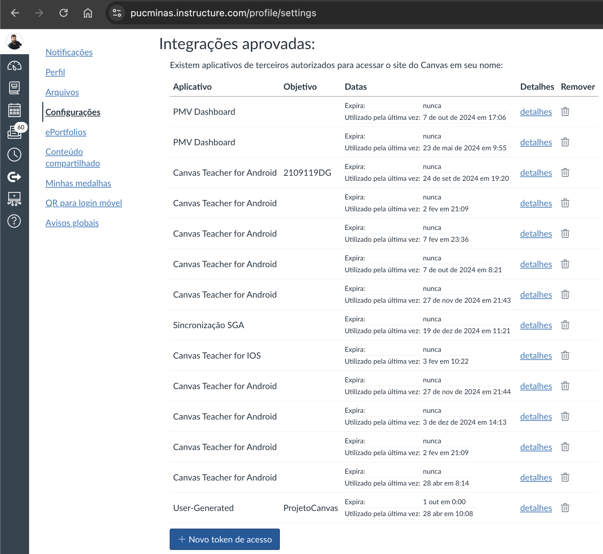
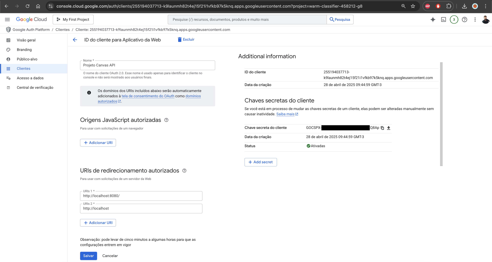
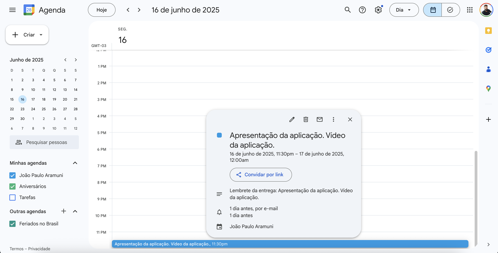

# Projeto Canvas API - Listagem de Tarefas e Integração com o Google Calendar

## Descrição
Este projeto utiliza a API do Canvas para recuperar informações sobre os cursos e as tarefas associadas ao usuário autenticado. O script exibe o nome do curso, o ID, e a lista de tarefas com suas respectivas datas de entrega, formatadas no fuso horário de São Paulo (UTC-3).

Além disso, o código integra-se ao Google Calendar, criando automaticamente lembretes para cada tarefa com data de entrega definida. Os lembretes são criados com base na data e hora de entrega das tarefas, com uma duração de 30 minutos.

Essa integração facilita o acesso a informações importantes sobre as tarefas diretamente da plataforma Canvas e apresenta-as de forma amigável, ao mesmo tempo que garante que o usuário não se esqueça de suas responsabilidades através de notificações no Google Calendar.

## Exemplo de Saída
O script irá gerar uma saída no formato abaixo para cada curso e suas tarefas:

### Versão 1
```
******************************************************************************************************************************************************
***** Curso: Projeto de Software - Engenharia de Software - Campus Coração Eucarístico - PMG - Noite - 2024/2 | ID do curso: 205259 *****
Tarefa: Trabalho 1 - SGO - Valor: 10 pontos | ID da Tarefa: 1011990 | Data de Entrega: 18/09/2024 23:59:00
Tarefa: Resenha do Artigo Big Ball of Mud | ID da Tarefa: 1015952 | Data de Entrega: 09/09/2024 23:59:00
Tarefa: Resenha do Artigo Thoughtworks Technology Radar | ID da Tarefa: 1018490 | Data de Entrega: 16/09/2024 23:59:00
Tarefa: Resenha do Artigo Microsservices  | ID da Tarefa: 1020616 | Data de Entrega: 06/10/2024 23:59:00
Tarefa: Trabalho Final - 20 pts | ID da Tarefa: 1023456 | Data de Entrega: 01/12/2024 23:59:00
Tarefa: Atividade Code Review | ID da Tarefa: 1023506 | Data de Entrega: 27/10/2024 23:59:00
Tarefa: Resenha dos Capítulos 6 e 7 do livro Engenharia de Software Moderna | ID da Tarefa: 1023515 | Data de Entrega: 18/10/2024 23:59:00
Tarefa: AV1 - 25 pontos | ID da Tarefa: 1029012 | Data de Entrega: 24/09/2024 23:59:00
Tarefa: AV2 - 25 pontos | ID da Tarefa: 1058667 | Data de Entrega: 03/12/2024 23:59:00
Tarefa: ADA | ID da Tarefa: 1059544 | Data de Entrega: 04/12/2024 23:59:00
******************************************************************************************************************************************************
```

### Versão 2
```
******************************************************************************************************************************************************
***** Curso: Trabalho Interdisciplinar: Aplicações para Cenários Reais - Engenharia de Software - Campus Coração Eucarístico - PMG - Noite - 2025/1 | ID do curso: 229198 *****
Tarefa: Documento de Visão. Ata(s) de reunião com o cliente. Termo de ciência, anuência e compromisso. Termo de sigilo e confidencialidade. Procuração ao NIT-PUC Minas. Planejamento da Sprint 1 com divisão de tarefas e responsabilidades. | ID da Tarefa: 1093729 | Data de Entrega: 10/03/2025 23:30:00
Evento criado: https://www.google.com/calendar/event?eid=dHMydTlvNTg0ZXFyZjVxOHZoMTcwMGoxazggam9hb3BhdWxvYXJhbXVuaUBt
Tarefa: Acompanhamento da Sprint #1 | ID da Tarefa: 1093723 | Data de Entrega: 17/03/2025 23:30:00
Evento criado: https://www.google.com/calendar/event?eid=MWFuZDZoMTE0b3JjM3JvajFlOGY4ZHAxN2Mgam9hb3BhdWxvYXJhbXVuaUBt
Tarefa: Entrega da  Sprint #1 | ID da Tarefa: 1093730 | Data de Entrega: 24/03/2025 23:30:00
Evento criado: https://www.google.com/calendar/event?eid=cjNrajlqb29xczBjc3JsOXI1MTZmc25wcmMgam9hb3BhdWxvYXJhbXVuaUBt
Tarefa: Acompanhamento da Sprint #2 | ID da Tarefa: 1093724 | Data de Entrega: 31/03/2025 23:30:00
Evento criado: https://www.google.com/calendar/event?eid=ZjNwcTdnZHBkZjdxbmRnOHI5ZzUwcmN0cGMgam9hb3BhdWxvYXJhbXVuaUBt
Tarefa: Entrega da Sprint #2 | ID da Tarefa: 1093731 | Data de Entrega: 07/04/2025 23:30:00
Evento criado: https://www.google.com/calendar/event?eid=cGNwbWxrajc4bTduMWFndGhvM2VkbWw2aTQgam9hb3BhdWxvYXJhbXVuaUBt
Tarefa: Acompanhamento da Sprint #3 | ID da Tarefa: 1093725 | Data de Entrega: 28/04/2025 23:30:00
Evento criado: https://www.google.com/calendar/event?eid=OXNrdmJwbjJjNmRidjRtbGZzMTU2cjYyaTQgam9hb3BhdWxvYXJhbXVuaUBt
Tarefa: Entrega da Sprint #3 | ID da Tarefa: 1093732 | Data de Entrega: 05/05/2025 23:30:00
Evento criado: https://www.google.com/calendar/event?eid=aGhvNXR1cjVodDI5cjU4cWN2NXY3MzV2NW8gam9hb3BhdWxvYXJhbXVuaUBt
Tarefa: Acompanhamento da Sprint #4 | ID da Tarefa: 1093726 | Data de Entrega: 12/05/2025 23:30:00
Evento criado: https://www.google.com/calendar/event?eid=OTg2cWkwZzhzN3J1M3RuZGliczZjcXJma28gam9hb3BhdWxvYXJhbXVuaUBt
Tarefa: Entrega da Sprint #4  | ID da Tarefa: 1093733 | Data de Entrega: 19/05/2025 23:30:00
Evento criado: https://www.google.com/calendar/event?eid=MGFqMDhnMG1mMHEzdDhnZmRodG80ODhjMjQgam9hb3BhdWxvYXJhbXVuaUBt
Tarefa: Acompanhamento da Sprint #5 | ID da Tarefa: 1093727 | Data de Entrega: 26/05/2025 23:59:59
Evento criado: https://www.google.com/calendar/event?eid=N2RkdWhtYjJtbjZoM2c2aGw4c2I3czl1Y2sgam9hb3BhdWxvYXJhbXVuaUBt
Tarefa: Entrega da Sprint #5 | ID da Tarefa: 1093734 | Data de Entrega: 02/06/2025 23:30:00
Evento criado: https://www.google.com/calendar/event?eid=NjA3MDNib2RmcjU5djV0cHRldmppZzZ1aTQgam9hb3BhdWxvYXJhbXVuaUBt
Tarefa: Preenchimento dos documentos de extensão | ID da Tarefa: 1093735 | Data de Entrega: 09/06/2025 23:30:00
Evento criado: https://www.google.com/calendar/event?eid=bDFzdnI5ZzZocGJhcjZqNTE1NmFzbWZ1YWcgam9hb3BhdWxvYXJhbXVuaUBt
Tarefa: Apresentação da aplicação. Vídeo da aplicação. | ID da Tarefa: 1093728 | Data de Entrega: 16/06/2025 23:30:00
Evento criado: https://www.google.com/calendar/event?eid=MGMwM21haGdudHN0Z2dncnRmb2ZwOHZsbzQgam9hb3BhdWxvYXJhbXVuaUBt
******************************************************************************************************************************************************
```

## Capturas de Tela

|  |
|:------:|
| Canvas |

|  |
|:------------:|
| Google Cloud |

|  |
|:---------------:|
| Google Calendar |

## Como gerar o Token de Acesso no Canvas

1. **Acesse o Canvas**:
   - Abra o navegador e vá para a URL do Canvas da sua instituição: [https://pucminas.instructure.com](https://pucminas.instructure.com).

2. **Faça o Login**:
   - Entre com seu nome de usuário e senha no Canvas, usando suas credenciais de acesso.

3. **Acesse as Configurações do Perfil**:
   - No canto superior esquerdo, clique no seu **avatar** ou nome de usuário.
   - No menu suspenso, clique em **Configurações**.

4. **Gerar o Token de Acesso**:
   - Na tela de configurações do seu perfil, localize a opção **"Tokens de Acesso"**.
   - Clique em **"Configurações"** no menu lateral e, depois, clique em **"Novo token de acesso"**.

5. **Preencha as Informações do Token**:
   - No campo **"Descrição"**, coloque um nome para o token, como **"API do Projeto"**.
   - Escolha a **data de expiração** do token, se desejar (pode ser indefinido).
   - Clique em **"Gerar Token"**.

6. **Copie o Token Gerado**:
   - O token será exibido uma única vez. **Copie o token gerado** e guarde em um lugar seguro.
   - Exemplo de token (não compartilhe com ninguém): `11748~U646vcwetXcJRXwhPMvZwNym9PKYLUhCZuRWmPBD4Yv2t4YnnkH2FG**********`.

7. **Substitua no Código**:
   - No seu código Python, substitua o valor da variável `API_KEY` pelo token gerado.

   ```python
   API_KEY = "seu_token_gerado_aqui"
   ```

## Integração com Google Calendar e Configuração da API

Este projeto utiliza a API do Google Calendar para criar lembretes de tarefas do Canvas. Para realizar a autenticação e a interação com o Google Calendar, utilizamos o OAuth 2.0, o que envolve a utilização de dois arquivos essenciais: `credentials.json` e `token.json`. Além disso, o código faz uso de um servidor local (`localhost:8080`) durante o processo de autenticação.

### Passos para configuração e funcionamento

#### 1. **Google Cloud Console**

Para usar a API do Google Calendar, você precisa configurar um projeto no Google Cloud Console e gerar as credenciais necessárias. Aqui estão os passos para isso:

1. **Criação do Projeto:**
   - Acesse o [Google Cloud Console](https://console.cloud.google.com/).
   - Crie um novo projeto ou use um projeto existente.

2. **Ativação da API do Google Calendar:**
   - No painel do projeto, vá até "APIs e Serviços" > "Biblioteca".
   - Procure por "Google Calendar API" e ative-a.

3. **Criação das Credenciais:**
   - No painel "APIs e Serviços" > "Credenciais", clique em "Criar Credenciais".
   - Selecione "ID do Cliente OAuth" e escolha o tipo "Aplicativo da Web".
   - Configure o `localhost:8080` como o URI de redirecionamento (ver abaixo).
   - Após criar as credenciais, vá até `Chave secreta do cliente` e baixe o arquivo `client_secret_255194037713-k9launmh82t4ej15f21i1vfkb97k5knq.apps.googleusercontent.com.json` (o nome do arquivo pode variar, mas será algo semelhante a isso).
   - Renomeie o arquivo baixado para `credentials.json` e coloque-o na mesma pasta onde está o seu código Python.

#### 2. **Arquivo `credentials.json`**

O arquivo `credentials.json` contém as credenciais necessárias para autenticar o usuário e permitir o acesso à API do Google Calendar. Esse arquivo inclui informações como o `client_id`, `client_secret` e outros detalhes que são necessários para o processo de OAuth 2.0.

- **Onde encontrar**: Você pode obter o `credentials.json` ao seguir os passos no Google Cloud Console, conforme descrito acima.
- **Onde armazenar**: Coloque o arquivo `credentials.json` no mesmo diretório onde seu script Python está localizado.

#### 3. **Processo de Autenticação e o Arquivo `token.json`**

Ao executar o script pela primeira vez, será necessário autenticar sua conta Google. O OAuth 2.0 solicita que o usuário faça login e forneça permissão ao aplicativo para acessar seu Google Calendar.

- **Como funciona**: O script abrirá um servidor local em `localhost:8080`, e o usuário precisará acessar essa URL em seu navegador para autorizar a aplicação.
- **Criando o `token.json`**: Após a autorização, o Google retorna um token de acesso que é armazenado em um arquivo chamado `token.json`. Esse arquivo contém as credenciais temporárias necessárias para acessar a API sem a necessidade de uma nova autenticação toda vez que o script for executado.

O arquivo `token.json` será criado automaticamente na primeira execução e armazenará os detalhes de autenticação, como o `access_token`, `refresh_token` e o tempo de expiração.

#### 4. **Localhost e o Redirecionamento para o Navegador**

Durante o processo de autenticação, o script utiliza o `localhost:8080` como um servidor local para receber a resposta de autorização do Google. Quando você autoriza a aplicação, o Google redireciona para esse endereço com um código de autorização, que o script usa para obter o token de acesso.

- **Por que `localhost:8080`**: O URI de redirecionamento configurado no Google Cloud Console é `http://localhost:8080/`. O servidor local garante que o código de autorização seja recebido corretamente e que o processo de autenticação seja concluído.

#### 5. **Fluxo de Autenticação**

Aqui está o fluxo simplificado de autenticação:

1. O script verifica se o arquivo `token.json` existe.
2. Se o `token.json` não existir ou estiver expirado, o script irá gerar um link de autorização e abrirá um servidor local em `localhost:8080`.
3. O usuário acessa o link, autoriza o acesso à conta do Google e é redirecionado de volta ao servidor local.
4. O código de autorização recebido é trocado por um `access_token` e um `refresh_token`, que são salvos em `token.json`.

### Resumo

- **`credentials.json`**: Contém as credenciais de cliente OAuth 2.0 que permitem que o script acesse a API do Google Calendar em nome do usuário.
- **`token.json`**: Contém o token de acesso (e refresh token) que autoriza o acesso à API, evitando a necessidade de autenticação repetida.
- **`localhost:8080`**: O servidor local que é usado durante o processo de autenticação para capturar o código de autorização do Google.

Esse processo garante que a interação com o Google Calendar seja segura e eficiente, utilizando OAuth 2.0 para autenticação e autorização.

## Dependências

- [CanvasAPI](https://pypi.org/project/canvasapi/): Biblioteca Python para acessar a API do Canvas LMS da Instructure. Esta biblioteca facilita a interação com o sistema Canvas, permitindo que desenvolvedores gerenciem programaticamente cursos, usuários, notas, tarefas e muito mais. O CanvasAPI foi criado e é mantido pela Universidade da Flórida Central (University of Central Florida) como um projeto de código aberto, oferecendo uma maneira eficiente e simples de integrar e automatizar o uso do Canvas LMS.

  - [GitHub CanvasAPI](https://github.com/ucfopen/canvasapi)
  - A biblioteca permite a automação de processos como:
    - Criação e gerenciamento de cursos
    - Acesso a dados de usuários e turmas
    - Gerenciamento de tarefas e notas
    - Interação com o gradebook (boletim de notas)
    - E muito mais, de forma programática.

  O projeto é de código aberto, o que significa que qualquer desenvolvedor pode contribuir e usar a biblioteca para integrar o Canvas LMS com outros sistemas e fluxos de trabalho.

- [pytz](https://pypi.org/project/pytz/): Biblioteca Python para trabalhar com fusos horários. Usada para garantir que as datas e horas sejam corretamente convertidas para o fuso horário local desejado.

- [google-auth](https://pypi.org/project/google-auth/): Biblioteca para autenticação com os serviços da Google, utilizada para gerenciar o acesso à API do Google Calendar. Ela lida com a autenticação de credenciais de usuários e permite a integração com o Google Cloud.

- [google-auth-oauthlib](https://pypi.org/project/google-auth-oauthlib/): Biblioteca para lidar com o fluxo OAuth2.0 da Google. Ela é responsável por gerenciar o processo de autenticação OAuth, permitindo a troca de tokens de autenticação para acessar APIs do Google.

- [google-auth-httplib2](https://pypi.org/project/google-auth-httplib2/): Biblioteca que integra o Google Auth com o `httplib2`, usada para enviar e receber solicitações HTTP ao interagir com a API do Google.

- [google-api-python-client](https://pypi.org/project/google-api-python-client/): Biblioteca oficial da Google para interagir com as APIs de serviços como o Google Calendar, Drive, Gmail e outros. Ela permite a criação e manipulação de eventos no Google Calendar, como é o caso do lembrete de tarefas do Canvas.

## Instalação das Dependências

Para executar este projeto, é necessário instalar as dependências. Siga os passos abaixo:

1. Crie um ambiente virtual:
   ```
   python -m venv .venv
   ```

2. Ative o ambiente virtual:
   - **Windows**:
     ```
     .venv\Scripts\activate
     ```
   - **Linux/MacOS**:
     ```
     source .venv/bin/activate
     ```

3. Instale as dependências:
   ```
   pip install canvasapi pytz google-auth google-auth-oauthlib google-auth-httplib2 google-api-python-client
   ```

# 🗓️ Estrutura do evento no Google Calendar com API Python

Abaixo a estrutura usada para criar eventos no Google Calendar com a biblioteca `google-api-python-client`.

```python
evento = {
    'summary': nome_tarefa,
    'description': f'Lembrete da entrega: {nome_tarefa}',
    'start': {
        'dateTime': start_datetime.isoformat(),
        'timeZone': 'America/Sao_Paulo',
    },
    'end': {
        'dateTime': end_datetime.isoformat(),
        'timeZone': 'America/Sao_Paulo',
    },
    'reminders': {
        'useDefault': False,
        'overrides': [
            {'method': 'popup', 'minutes': 60},     # Notificação pop-up 1h antes
            {'method': 'email', 'minutes': 1440},   # E-mail 1 dia antes
        ],
    },
    'colorId': '10',  # Cor verde no Google Calendar
}
```

## 🔍 Explicação de cada campo

| Campo         | Tipo        | Descrição |
|---------------|-------------|-----------|
| `summary`     | `str`       | Título do evento — geralmente o nome da tarefa. |
| `description` | `str`       | Detalhes adicionais sobre a tarefa ou evento. |
| `start`       | `dict`      | Início do evento. Deve incluir `dateTime` no formato ISO 8601 e o `timeZone`. |
| `end`         | `dict`      | Fim do evento. Mesmo formato do campo `start`. |
| `reminders`   | `dict`      | Configura lembretes personalizados: `popup` 1h antes, `email` 1 dia antes. |
| `colorId`     | `str`       | Cor do evento (neste exemplo, verde). Ex: `'1'` azul, `'10'` verde, `'11'` vermelho. |

---

## 🎨 Códigos de Cor do Google Calendar

| Cor         | ID  |
|-------------|-----|
| Azul        | 1   |
| Roxo        | 3   |
| Verde       | 10  |
| Vermelho    | 11  |
| Amarelo     | 5   |
| Laranja     | 6   |
| Rosa        | 9   |

---

## Observações
- Quando uma tarefa é atribuída pelo professor a um section group específico, a API do Canvas pode retornar o campo `assignment.due_at` como `None`.
- Quando a tarefa é atribuída ao grupo "Todos os demais", o campo `assignment.due_at` geralmente vem preenchido com a data de entrega.

## Documentação e Links Úteis

- [CanvasAPI no GitHub](https://github.com/ucfopen/canvasapi)
- [CanvasAPI no PyPI](https://pypi.org/project/canvasapi/)
- [pytz no PyPI](https://pypi.org/project/pytz/)
- [google-auth no PyPI](https://pypi.org/project/google-auth/)
- [google-auth-oauthlib no PyPI](https://pypi.org/project/google-auth-oauthlib/)
- [google-auth-httplib2 no PyPI](https://pypi.org/project/google-auth-httplib2/)
- [google-api-python-client no PyPI](https://pypi.org/project/google-api-python-client/)
- [Documentação do CanvasAPI](https://canvasapi.readthedocs.io/en/stable/)
- [Exemplos do CanvasAPI - Cursos](https://canvasapi.readthedocs.io/en/stable/examples.html#courses)
- [Exemplos do CanvasAPI - Tarefas](https://canvasapi.readthedocs.io/en/stable/examples.html#assignments)
- [Documentação da API do Canvas](https://canvas.instructure.com/doc/api/index.html)
- [Documentação da API do Google Calendar](https://developers.google.com/calendar)

## Licença

Este projeto está licenciado sob a Licença MIT.
