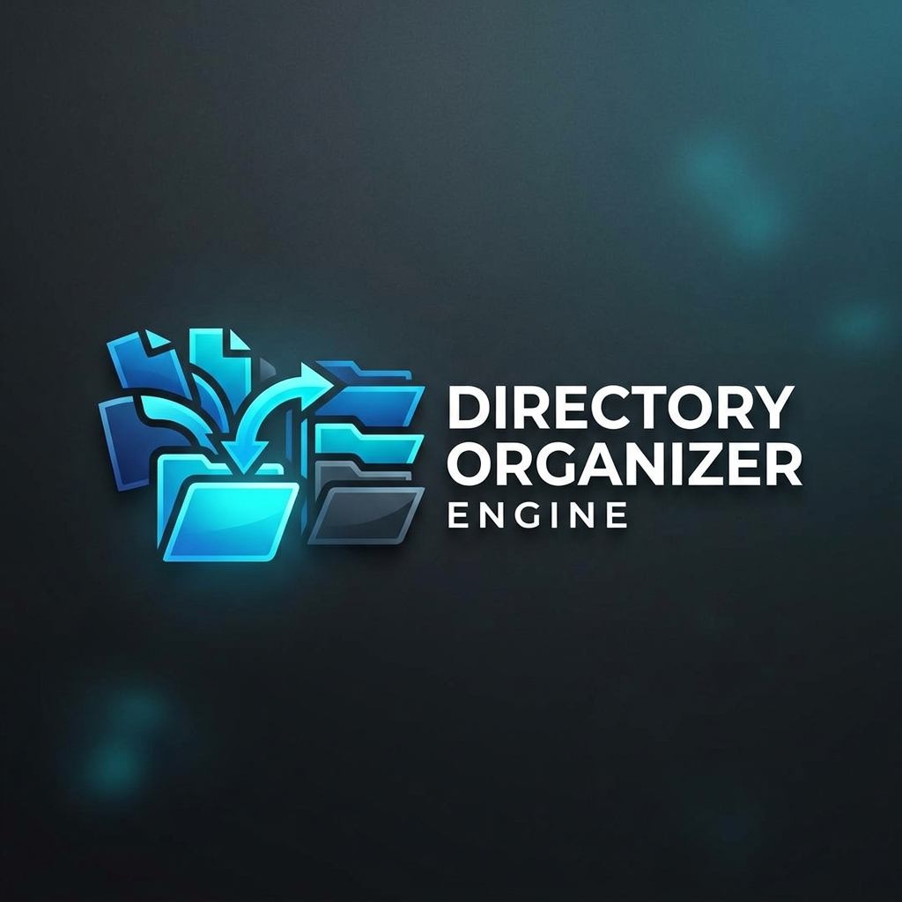
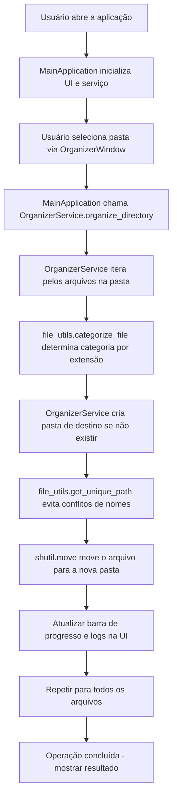

<p align="center">
  
</p>

<h1 align="center">Projeto Directory Organizer Engine</h1>

<p align="center">
  <strong>Um motor de organização de arquivos potente, seguro e multiplataforma para manter seus diretórios sempre organizados.</strong>
</p>

<p align="center">
  
  
  
  
  
</p>

---

## 🌟 Visão Geral

O **Directory Organizer Engine** é uma ferramenta desenvolvida para resolver a desordem digital. Com uma interface moderna e intuitiva, ele automatiza a tarefa tediosa de classificar arquivos, movendo-os para pastas categorizadas com base em suas extensões. Ideal para manter áreas de trabalho, downloads e pastas pessoais sempre limpas e organizadas.

<p align="center">
  
</p>

---

## 🚀 Funcionalidades Principais

- 🧠 **Organização Inteligente**: Detecta e move arquivos automaticamente para categorias predefinidas (ex.: PDFs, Imagens, Vídeos, Executáveis, Documentos, Áudio, Compactados, Outros).
- 🛡️ **Segurança de Arquivos**: Sistema anti-conflito que renomeia arquivos duplicados (ex.: `arquivo.pdf` vira `arquivo (1).pdf`) em vez de sobrescrevê-los.
- 🎨 **Interface Premium**: Interface baseada em `ttkbootstrap` com tema escuro nativo, responsiva e com feedback visual em tempo real.
- 📊 **Monitoramento em Tempo Real**: Barra de progresso e logs detalhados para acompanhar cada operação.
- ⚙️ **Altamente Customizável**: Edite facilmente temas, categorias de arquivos e extensões no arquivo de configuração.
- 🔄 **Processamento Seguro**: Não organiza subpastas por padrão (configurável), evitando alterações indesejadas.
- 📁 **Compatibilidade**: Funciona em Windows, Linux e macOS.

---

## 🛠️ Tecnologias Utilizadas

O projeto utiliza tecnologias modernas e robustas do ecossistema Python:

- **Linguagem**: [Python 3.10+](https://www.python.org/) – Versátil e eficiente.
- **Interface Gráfica**: [ttkbootstrap](https://ttkbootstrap.readthedocs.io/) – Temas modernos sobre Tkinter.
- **Manipulação de Arquivos**: `pathlib` e `shutil` – Bibliotecas padrão para operações seguras.
- **Empacotamento**: [PyInstaller](https://pyinstaller.org/) – Para criar executáveis standalone.
- **Logging**: Sistema integrado para auditoria e depuração.

---

## 📁 Estrutura do Projeto

A arquitetura modular facilita manutenção e extensões:

```
Directory-Organizer-Engine/
├── .venv/                  # Ambiente virtual (criado com python -m venv)
├── assets/                 # Recursos visuais (ícones, logos, mockups)
├── dist/                   # Executável gerado pelo PyInstaller (main.exe)
├── engine/
│   ├── application/        # Controle principal da aplicação
│   │   └── main_app.py     # Classe MainApplication (integra UI e serviço)
│   ├── config/             # Configurações globais
│   │   └── settings.py     # Categorias, temas e opções
│   ├── service/            # Lógica de negócio
│   │   └── organizer_service.py  # Serviço de organização de arquivos
│   ├── ui/                 # Componentes da interface
│   │   ├── app_ui.py       # Janela principal
│   │   └── components.py   # Componentes reutilizáveis (ex.: LogView)
│   └── utils/              # Utilitários
│       └── file_utils.py   # Funções para manipulação de arquivos
├── test_organizer/         # Pasta de teste (Compactados/, Imagens/, Outros/, PDFs/, Vídeos/)
├── main.py                 # Ponto de entrada da aplicação
├── test_verify_logic.py    # Script de teste para validação
├── requirements.txt        # Dependências Python
├── organizer.log           # Arquivo de logs (gerado automaticamente)
└── README.md               # Esta documentação
```

---

## 🔄 Como o Sistema Funciona

O diagrama abaixo ilustra o fluxo de funcionamento da aplicação:



---

## ⚙️ Como Começar

### Pré-requisitos
- [Python 3.10 ou superior](https://www.python.org/downloads/) instalado.
- (Opcional) Ambiente virtual para isolamento de dependências.

### Instalação e Execução

1. **Clone o repositório**:
   ```bash
   git clone https://github.com/Davii13/Directory-Organizer-Engine.git
   cd Directory-Organizer-Engine
   ```

2. **Crie e ative um ambiente virtual** (recomendado):
   ```bash
   python -m venv .venv
   # No Windows:
   .venv\Scripts\activate
   # No Linux/Mac:
   source .venv/bin/activate
   ```

3. **Instale as dependências**:
   ```bash
   pip install -r requirements.txt
   ```

4. **Execute a aplicação**:
   ```bash
   python main.py
   ```

### 🖥️ Criando um Executável (EXE)

Para distribuir a aplicação sem exigir Python instalado, crie um executável usando PyInstaller:

1. Instale o PyInstaller (no ambiente virtual):
   ```bash
   pip install pyinstaller
   ```

2. Execute o comando de empacotamento:
   ```bash
   pyinstaller --clean --onefile --windowed --icon="assets/logoEXE.ico" --add-data "assets;assets" main.py
   ```

   - `--clean`: Limpa arquivos temporários.
   - `--onefile`: Gera um único arquivo .exe.
   - `--windowed`: Oculta o console (ideal para GUIs).
   - `--icon`: Define o ícone do executável.
   - `--add-data`: Inclui a pasta `assets` no .exe.

3. O executável será criado em `dist/main.exe`.

**Nota**: O .exe é fornecido em um arquivo ZIP nas releases porque o GitHub pode rejeitá-lo por suspeita de malware. Baixe e extraia antes de executar. Sempre verifique o código-fonte para segurança.

### 🧪 Testando a Lógica

Execute o script de teste para validar a organização:
```bash
python verify_logic.py
```
Ele cria arquivos de teste, organiza-os e verifica os resultados.

---

## 📝 Configuração Personalizada

Personalize o comportamento editando `engine/config/settings.py`:

- **Adicionar categorias**:
  ```python
  FILE_CATEGORIES = {
      'Projetos': ['.py', '.js', '.html', '.css'],
      # ... outras
  }
  ```

- **Alterar tema** (opções: `cosmo`, `flatly`, `darkly`, `cyborg`, etc.):
  ```python
  APP_THEME = 'cyborg'
  ```

- **Outras opções**:
  - `DEFAULT_OTHER_FOLDER`: Pasta para arquivos não categorizados.
  - `RECURSIVE_SCAN`: Organize subpastas (padrão: `False`).
  - `LOG_FILE_NAME`: Nome do arquivo de logs.

## 🔧 Solução de Problemas

- **Erro "unknown option -padding"**: Verifique a versão do ttkbootstrap (`pip install --upgrade ttkbootstrap`).
- **Ícone não aparece na barra de tarefas**: Certifique-se de que `logoEXE.ico` é um arquivo .ico válido. Reconstrua o .exe.
- **Arquivos não organizados**: Verifique permissões de escrita na pasta selecionada.
- **Logs não gerados**: Arquivo `organizer.log` é criado na execução.

---

## 🤝 Contribuição

Contribuições são bem-vindas! Siga estes passos:

1. Faça um Fork do projeto.
2. Crie uma branch para sua feature (`git checkout -b feature/NovaFeature`).
3. Faça commits descritivos (`git commit -m 'Adiciona NovaFeature'`).
4. Push para a branch (`git push origin feature/NovaFeature`).
5. Abra um Pull Request.

---

## 🙏 Agradecimentos

Agradecimentos especiais ao Professor João Paulo Aramuni pela orientação e ajuda na criação deste projeto. Sua contribuição foi fundamental para o desenvolvimento e aprendizado.

---

## 📜 Licença

Este projeto está licenciado sob a MIT License.

---

<p align="center">
  Desenvolvido por <a href="https://github.com/Davii13">Davii13</a>, aluno do 4° período do curso de Engenharia de Software da PUC Minas durante as oficinas de desenvolvimento "DevLabs" ministradas pelo professor João Paulo Aramuni | <a href="https://github.com/Davii13/Directory-Organizer-Engine/issues">Reportar Issues</a>
</p>
