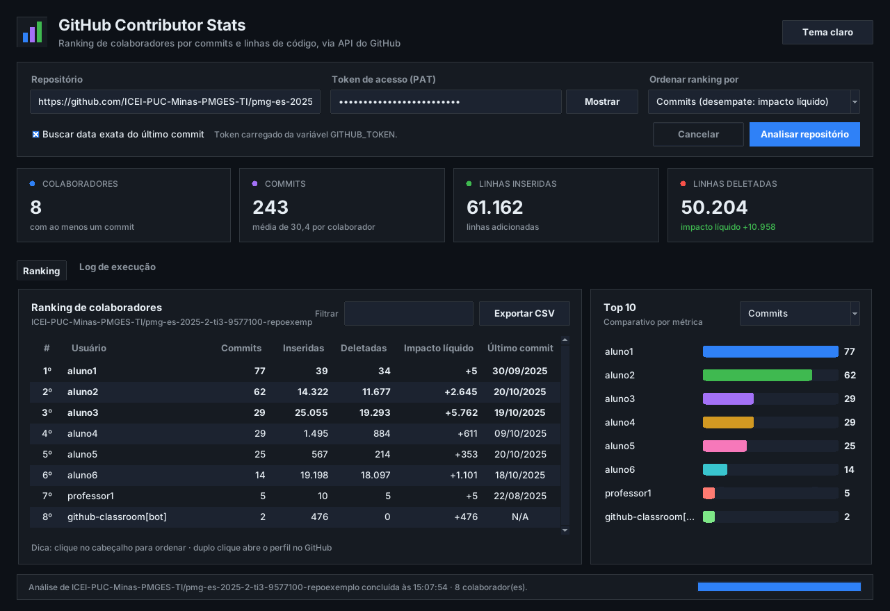
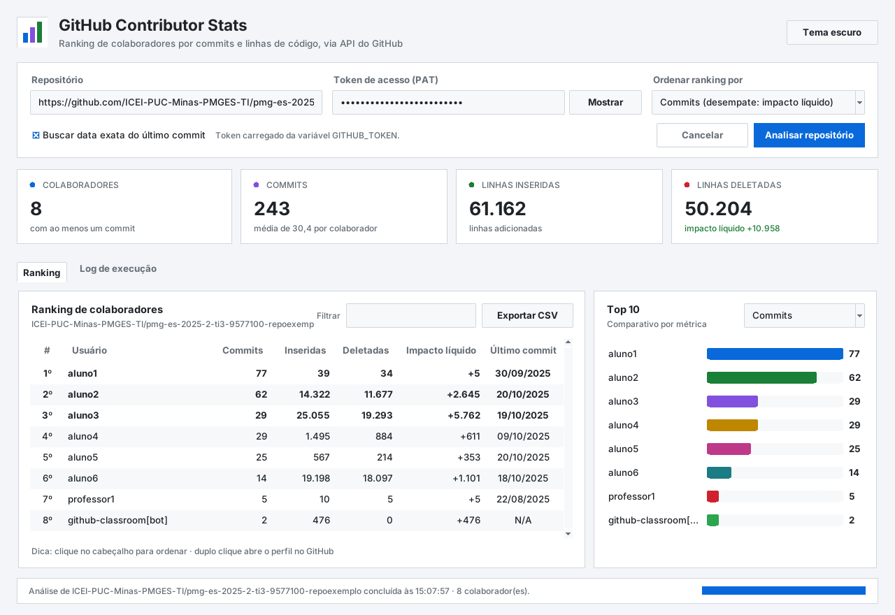

# 🚀 Projeto GitHubAPI ContributorStats

O **GitHubAPI ContributorStats** é uma ferramenta Python para analisar repositórios do GitHub (públicos e **privados**) e gerar um **ranking detalhado dos colaboradores** com base em métricas reais de código. Ela usa o Token de Acesso Pessoal (PAT) do GitHub para acessar os dados e trata o processamento assíncrono das estatísticas da API (*polling* da resposta `202 Accepted`).

O projeto pode ser usado de duas formas:

- 🖥️ **Interface gráfica** moderna em **Tkinter + ttk**, com tema claro/escuro, indicadores, tabela ordenável, gráfico Top 10 e exportação para CSV;
- ⌨️ **Linha de comando (CLI)**, ideal para automatizar e gerar o CSV direto no terminal.

### 🎯 Objetivo

Mostrar com clareza quem mais contribuiu para um repositório, não só pela quantidade de *commits*, mas também pelo **volume de linhas de código** adicionadas e removidas (**Impacto Líquido**). O resultado pode ser exportado para um arquivo CSV.

---

## 🖼️ Interface gráfica



<details>
<summary>Ver tema claro</summary>



</details>

> As capturas usam os dados de exemplo (`aluno1`…`aluno6`) mostrados na seção da CLI.

**Recursos da interface**

- Campo de URL que aceita `https://github.com/dono/repo`, `.git`, links com `/tree/...`, SSH (`git@github.com:dono/repo.git`) ou só `dono/repo`;
- Token mascarado (botão **Mostrar/Ocultar**), preenchido automaticamente com o token definido em `core/config.py`;
- A análise roda em segundo plano: a janela não trava, há barra de progresso e botão **Cancelar** (ou `Esc`);
- Cartões com o total de colaboradores, commits, linhas inseridas/deletadas e impacto líquido;
- Tabela com destaque para o Top 3, **ordenação ao clicar no cabeçalho** e **filtro** por usuário;
- Duplo clique abre o perfil do colaborador no GitHub; o botão direito permite copiar o nome de usuário;
- Gráfico de barras Top 10 por commits, linhas inseridas, deletadas ou impacto líquido;
- Troca do critério do ranking **sem nova consulta à API**;
- Aba **Log de execução** com o histórico de cada etapa;
- **Exportar CSV** (`Ctrl+E` / `Cmd+E`) para o local escolhido;
- Alternância entre **tema escuro e claro**.

---

## 🗂️ Estrutura do projeto

A regra de negócio fica separada da interface: o pacote `core` não usa `print` nem Tkinter e comunica o andamento por *callbacks*. Assim, a CLI e a GUI usam exatamente o mesmo código.

```
Projeto GitHubAPI ContributorStats/
├── core/                    # Regra de negócio (sem interface)
│   ├── config.py            # 🔑 Seu token (GITHUB_TOKEN) e demais constantes
│   ├── exceptions.py        # Exceções do domínio
│   ├── models.py            # Dataclasses: Contributor, AnalysisResult, ProgressEvent
│   ├── repo_url.py          # Interpretação da URL do repositório
│   ├── github_client.py     # Cliente da API do GitHub (Session, timeout, erros)
│   ├── ranking.py           # Montagem e ordenação do ranking
│   ├── exporter.py          # Exportação para CSV
│   └── service.py           # Caso de uso: analyze_repository()
├── gui/                     # Interface gráfica (Tkinter + ttk)
│   ├── theme.py             # Paletas (escuro/claro), fontes e estilos ttk
│   ├── widgets.py           # Card, StatCard e BarChart (Canvas)
│   └── app.py               # Janela principal
├── assets/                  # Capturas de tela
├── contributor_stats.py     # Ponto de entrada da CLI
├── main_gui.py              # Ponto de entrada da GUI
└── requirements.txt
```

---

## 🛠️ Pré-requisitos

- **Python 3.9+** com **Tkinter** (já incluso no instalador oficial do Windows/macOS; no Linux: `sudo apt install python3-tk`).
- Um **Personal Access Token (PAT)** do GitHub com o *scope* **`repo`** — obrigatório para repositórios privados. Para repositórios públicos ele é opcional, mas eleva o limite da API de 60 para 5.000 requisições/hora.

---

## 🐍 Ambiente virtual (recomendado)

1. **Crie o ambiente virtual:**
```bash
python -m venv .venv
```

2. **Ative o ambiente virtual:**

- **Windows:**
```bash
.venv\Scripts\activate
```

- **Linux/macOS:**
```bash
source .venv/bin/activate
```

3. **Instale as dependências:**
```bash
pip install -r requirements.txt
```

---

## 🔑 Configuração do token

Abra o arquivo **`core/config.py`** e substitua `"SEU_TOKEN_AQUI"` pelo seu PAT:

```python
GITHUB_TOKEN = "ghp_seu_token_aqui"  # !! Substitua pelo seu PAT real !!
```

Pronto: a CLI usa esse token automaticamente e a interface gráfica já abre com o campo preenchido.

Se preferir, também é possível informar o token direto no campo da interface gráfica ou com `--token` na CLI (esses valores têm prioridade sobre o do arquivo).

> ⚠️ **Não faça commit do seu token real.** O GitHub detecta tokens publicados em repositórios públicos e os revoga automaticamente. Antes de dar `git push`, volte o valor para `"SEU_TOKEN_AQUI"`.

---

## ⚙️ Execução

### 🖥️ Interface gráfica

```bash
python main_gui.py
```

### ⌨️ Linha de comando

```bash
python contributor_stats.py <URL_DO_REPOSITORIO>
```

| Opção | Descrição |
| :--- | :--- |
| `repo_url` | URL do repositório (ou `dono/repo`). Se omitida, usa o repositório de exemplo. |
| `--token TOKEN` | PAT do GitHub (padrão: `GITHUB_TOKEN` de `core/config.py`). |
| `--sort {commits,impacto,insercoes}` | Critério de ordenação (padrão: `commits`, desempate por impacto líquido). |
| `--no-exact-dates` | Não consulta a data exata do último commit; usa a semana aproximada (mais rápido). |
| `--output`, `-o` | Caminho do CSV gerado. |
| `--top N` | Quantos colaboradores exibir no console (padrão: 10). |

**Exemplo:**
```bash
python contributor_stats.py https://github.com/ICEI-PUC-Minas-PMGES-TI/pmg-es-2025-2-ti3-9577100-repoexemplo --top 5
```

### Exemplo de saída no terminal

```
• Buscando estatísticas (tentativa 1/6) de ICEI-PUC-Minas-PMGES-TI/pmg-es-2025-2-ti3-9577100-repoexemplo…
✔ Estatísticas recebidas com sucesso.
• [0/8] Buscando a data do último commit…
• [1/8] Último commit de aluno1: 30/09/2025
...
✔ Ranking gerado com 8 colaborador(es).

✅ Sucesso! Ranking exportado para: ranking_contribuicao_pmg-es-2025-2-ti3-9577100-repoexemplo.csv

--- TOP 10 Contribuidores — ICEI-PUC-Minas-PMGES-TI/pmg-es-2025-2-ti3-9577100-repoexemplo ---
1. aluno1 (https://github.com/aluno1)
   -> Commits: 77 | Inseridas: 39 | Deletadas: 34 | Impacto Líquido: 5 | Último Commit: 30/09/2025
2. aluno2 (https://github.com/aluno2)
   -> Commits: 62 | Inseridas: 14322 | Deletadas: 11677 | Impacto Líquido: 2645 | Último Commit: 20/10/2025
3. aluno3 (https://github.com/aluno3)
   -> Commits: 29 | Inseridas: 25055 | Deletadas: 19293 | Impacto Líquido: 5762 | Último Commit: 19/10/2025
...
8. github-classroom[bot] (https://github.com/apps/github-classroom)
   -> Commits: 2 | Inseridas: 476 | Deletadas: 0 | Impacto Líquido: 476 | Último Commit: ~18/08/2025
```

> 💡 Datas com `~` são **aproximadas** (início da última semana com commits). Isso acontece quando a data exata não pode ser obtida — por exemplo, contas *bot* — ou quando se usa `--no-exact-dates`.

### 📄 Formato do CSV

Separado por `;` e salvo em UTF-8 com BOM, para abrir com acentuação correta no Excel:

```
Posição;Nome de Usuário;URL Perfil;Commits Totais;Linhas Inseridas;Linhas Deletadas;Impacto Líquido (Ins - Del);Último Commit
1;aluno1;https://github.com/aluno1;77;39;34;5;30/09/2025
```

---

## 📊 Principais funções e classes

| Módulo | Elemento | Propósito |
| :--- | :--- | :--- |
| `core/repo_url.py` | `parse_repo_url(repo_url) -> tuple[str, str]` | Extrai **dono** e **repositório** de vários formatos de URL; lança `InvalidRepoURLError`. |
| `core/github_client.py` | `GitHubClient.fetch_contributors_stats(owner, repo, ...)` | Consulta `/stats/contributors` com **polling** cancelável para o status `202`. |
| `core/github_client.py` | `GitHubClient.fetch_last_commit_date(owner, repo, username)` | Data exata do último commit do usuário (ou `None`). |
| `core/ranking.py` | `build_contributors(data)` | Converte o JSON da API em objetos `Contributor` (soma inserções/deleções). |
| `core/ranking.py` | `rank_contributors(contributors, criterion)` | Ordena por `SortCriterion` e define a posição. |
| `core/exporter.py` | `export_to_csv(contributors, path)` | Grava o ranking em CSV. |
| `core/service.py` | `analyze_repository(repo_url, token, ...)` | Orquestra todo o fluxo e devolve um `AnalysisResult`. |
| `gui/app.py` | `ContributorStatsApp` | Janela principal Tkinter/ttk. |
| `contributor_stats.py` | `main(argv)` | CLI: argumentos, progresso no terminal e Top N. |

---

## ✨ Melhorias em relação à versão anterior

| Antes | Agora |
| :--- | :--- |
| Token definido no meio do script principal. | Token em um único lugar, `core/config.py`, com opção de informá-lo pela interface ou por `--token`. |
| A verificação do token comparava com `"SEU_TOKEN_AQUI"`, mas o *placeholder* era `"ghp_###..."`, então nunca funcionava. | Se o token não for substituído, o programa avisa e segue apenas para repositórios públicos. |
| Requisições sem `timeout` podiam travar indefinidamente. | Todas as requisições têm `timeout` e usam `requests.Session` (reaproveita conexões). |
| `contributor['author']` nulo (conta excluída) causava `TypeError`. | Tratado como “(usuário desconhecido)”. |
| Uma requisição **sequencial** por colaborador para buscar a data do último commit. | Requisições **em paralelo** (`ThreadPoolExecutor`) e opção para desativá-las. |
| `N/A` quando a data não podia ser obtida (ex.: bots). | Data aproximada a partir das semanas com commits (marcada com `~`). |
| Erros 401/404/limite de requisições exibiam só o código HTTP. | Mensagens explicativas, incluindo o horário de renovação do limite. |
| `print` e `sys.exit` dentro das funções: impossível reaproveitar em uma GUI. | Exceções próprias + *callbacks* de progresso; CLI e GUI compartilham o mesmo `core`. |
| URL aceita apenas no formato `https://github.com/dono/repo`. | Aceita também `.git`, `/tree/...`, SSH e `dono/repo`; rejeita hosts que não sejam do GitHub. |
| Cabeçalho `Authorization: token` e `Accept` v3. | `Authorization: Bearer`, `application/vnd.github+json` e `X-GitHub-Api-Version`. |
| Espera fixa com `time.sleep` durante o *polling*. | Espera cancelável (`threading.Event.wait`). |
| CSV sem posição e com acentos quebrados no Excel. | Coluna **Posição** e codificação `utf-8-sig`. |
| Critério de ordenação só por comentário no código. | `--sort` / seletor na interface (commits, impacto líquido ou linhas inseridas). |

> ⚠️ **Limitação da API:** para repositórios com mais de 10.000 commits, o GitHub retorna `0` em inserções e deleções no endpoint `/stats/contributors`. A contagem de commits continua correta.

---

## 📚 Documentação e Links Úteis

- 🔑 **Página de Geração de Tokens (PATs) no GitHub:** [github.com/settings/tokens](https://github.com/settings/tokens)
- 🔑 **Como criar seu Personal Access Token (PAT):** [Managing your personal access tokens](https://docs.github.com/en/authentication/keeping-your-account-and-data-secure/managing-your-personal-access-tokens)
- 🧩 **Documentação oficial da API do GitHub (Estatísticas):** [REST API Endpoints for Repository Statistics](https://docs.github.com/en/rest/metrics/statistics?apiVersion=2022-11-28)
- 🐍 **Documentação oficial do módulo `requests`:** [Python Requests](https://docs.python-requests.org/en/latest/)
- 🎨 **Documentação do Tkinter / ttk:** [tkinter — Python interface to Tcl/Tk](https://docs.python.org/3/library/tkinter.html) · [tkinter.ttk — Tk themed widgets](https://docs.python.org/3/library/tkinter.ttk.html)

---

## 🧾 Licença

Este projeto é disponibilizado sob a licença **MIT**.

---
