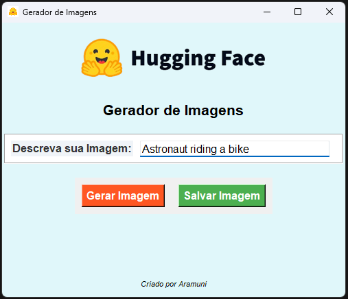
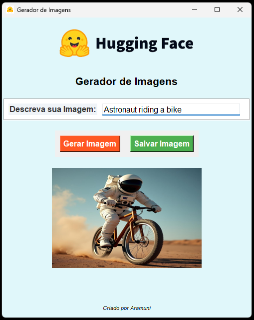

# Projeto de Geração de Imagens com Hugging Face (With UI)

Este projeto é um gerador de imagens que utiliza a API do Hugging Face para criar imagens a partir de descrições fornecidas pelo usuário. A interface é construída com Tkinter e permite a geração e salvamento das imagens geradas.

## Como Funciona

O código envia uma solicitação POST para a API de inferência da Hugging Face, que utiliza modelos de IA treinados para gerar uma imagem com base na descrição fornecida. Esse processo demonstra como a IA pode ser aplicada para transformar texto em representações visuais, facilitando a criação de conteúdo visual a partir de descrições verbais.

## Funcionalidades

- Geração de imagens a partir de um texto descritivo.
- Opção de salvar a imagem gerada no formato PNG.
- Interface amigável e intuitiva.

## Capturas de Tela

- **Tela de Home**: A tela inicial apresenta um campo texto onde o usuário pode inserir uma descrição para a imagem que deseja gerar.
- **Tela de Download**: Após o processamento, a tela apresenta uma pré-visualização da imagem gerada, permitindo que o usuário veja o resultado antes de baixá-la. Um botão de download está disponível para salvar a imagem gerada no dispositivo.

|  |  |
|:--:|:--:|
| Tela Inicial | Tela de Download |

## Dependências

Para executar este projeto, você precisará das seguintes bibliotecas Python:

- `requests`: Para fazer requisições HTTP à API do Hugging Face.
- `Pillow`: Para manipulação de imagens.
- `tkinter`: Para a interface gráfica do usuário.

Você pode instalar as dependências necessárias utilizando o seguinte comando:

```bash
pip3 install requests Pillow
```

## Como Criar Seu Próprio Token no Hugging Face

Para usar a API do Hugging Face, você precisará criar um token de autenticação. Aqui estão os passos:

1. **Criar uma Conta**:
   - Acesse o site do Hugging Face: [Hugging Face](https://huggingface.co/).
   - Se você não tem uma conta, clique em **Sign Up** para criar uma.

2. **Fazer Login**:
   - Após criar sua conta, faça login clicando em **Login** no canto superior direito.

3. **Acessar Configurações de Token**:
   - Após o login, clique no seu nome de usuário no canto superior direito e selecione **Settings**.
   - Na página de configurações, encontre a seção **Access Tokens**.

4. **Criar um Novo Token**:
   - Clique em **New token**.
   - Dê um nome ao seu token e selecione as permissões necessárias. Para uso básico, as permissões padrão são suficientes.
   - Clique em **Generate** para criar o token.

5. **Copiar o Token**:
   - Uma vez gerado, copie o token que foi exibido. **Mantenha esse token em segredo**, pois ele concede acesso à sua conta.

## Integrar o Token ao Código

Depois de obter seu token, você precisa integrá-lo ao seu código no arquivo `app.py`. Encontre a linha:

Substitua pelo seu token copiado:

```python
headers = {"Authorization": "Bearer hf_seutoken"}  # Coloque seu token aqui
```

## Dependências

Este projeto requer as seguintes bibliotecas:
- requests
- io
- PIL (Pillow)

Você pode instalá-las usando o seguinte comando:

```bash
pip3 install requests pillow
```

## Execução do Projeto

Para executar o projeto, basta rodar o arquivo `interface.py`:

```bash
python3 interface.py
```

## Ambiente Virtual

É recomendável usar um ambiente virtual para gerenciar suas dependências. Siga os passos abaixo para configurar um ambiente virtual:

1. Crie um ambiente virtual usando o seguinte comando:
    ```bash
    python3 -m venv .venv
    ```
2. Ative o ambiente virtual:
    - No macOS e Linux:
        ```bash
        source .venv/bin/activate
        ```
    - No Windows:
        ```bash
        .venv\Scripts\activate
        ```

Para este exemplo, foi escolhida a imagem:
- Astronaut riding a horse (Astronauta andando a cavalo)

## Como Gerar o Executável

Para gerar o executável, siga os passos abaixo:

1. Certifique-se de ter o `PyInstaller` instalado. Caso não tenha, instale com o comando:
   ```bash
   pip3 install pyinstaller
   ```

2. Navegue até o diretório onde o código-fonte está salvo e execute o seguinte comando:
   ```bash
   pyinstaller --onefile --windowed --icon=icon.ico interface.py
   ```

   - `--onefile`: Cria um único arquivo executável.
   - `--windowed`: Oculta o terminal ao abrir a interface gráfica.
   - `--icon=icon.ico`: Define o ícone do executável como `icon.ico`.

3. O executável gerado estará na pasta `dist/`.

## Como Usar

1. Abra o arquivo executável (`compressor.exe`).
2. Na interface, clique em "Selecionar Imagem" para escolher uma imagem do seu computador.
3. Use o controle deslizante para ajustar a qualidade da compressão (quanto menor o valor, maior a compressão).
4. Clique em "Comprimir Imagem" para salvar a imagem comprimida.

## Documentação
- [Hugging Face Website](https://huggingface.co/)
- [Link da documentação da API](https://huggingface.co/docs/api-inference/tasks/text-to-image?code=python#text-to-image)

## Considerações Finais

- **Segurança**: Nunca compartilhe seu token publicamente e evite incluí-lo diretamente no código que será versionado em sistemas de controle de versão como Git. Considere usar variáveis de ambiente para armazená-lo de forma mais segura.
- **Limites de Uso**: Fique atento ao uso da API, pois pode haver limites dependendo do seu plano na Hugging Face.

Aproveite o seu gerador de imagens!

## Licença

Este projeto é de código aberto e está licenciado sob a MIT License. Sinta-se livre para usá-lo e modificá-lo conforme necessário.
