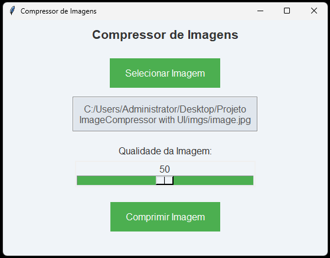
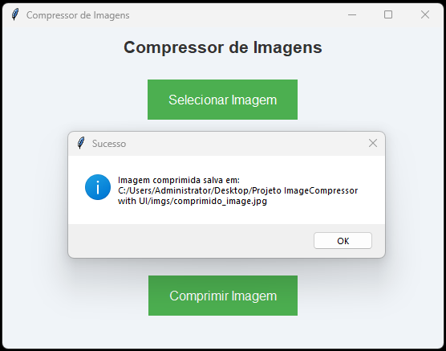

# Compressor de Imagens

Este é um programa de compressão de imagens com uma interface gráfica construída em Python usando a biblioteca `Tkinter`. Ele permite que o usuário selecione uma imagem, ajuste a qualidade de compressão e salve a versão comprimida. Este README inclui instruções para gerar o executável (.exe) do projeto.

## Funcionalidades

- **Upload de Imagem**: Seleção de uma imagem no formato `.jpg`, `.jpeg` ou `.png`.
- **Ajuste de Qualidade**: Controle de qualidade da compressão, de 1 a 100.
- **Interface Gráfica**: Interface amigável e intuitiva para facilitar o uso.
- **Versão Executável (.exe)**: Pode ser gerado para uso direto no Windows, sem necessidade de instalar Python.

## Captura de Tela

- **Tela de Home**: A tela inicial apresenta um botão onde o usuário pode selecionar uma imagem para compressão, uma barra deslizante para especificar a qualidade desejada e iniciar o processo.

|  |  |
|:----------------------:|:----------------------:|
|         Home 1         |         Home 2         |

No exemplo apresentado, o arquivo original `image.jpg`, com um tamanho de 3.2 MB, foi comprimido para `comprimido_image.jpg`, que agora ocupa apenas 893 KB. Essa compressão foi realizada utilizando um parâmetro de qualidade de 0.5, demonstrando uma redução significativa no tamanho do arquivo, mantendo uma qualidade aceitável da imagem.

## Como Gerar o Executável

Para gerar o executável, siga os passos abaixo:

1. Certifique-se de ter o `PyInstaller` instalado. Caso não tenha, instale com o comando:
   ```bash
   pip3 install pyinstaller
   ```

2. Navegue até o diretório onde o código-fonte está salvo e execute o seguinte comando:
   ```bash
   pyinstaller --onefile --windowed --icon=icone.ico compressor.py
   ```

   - `--onefile`: Cria um único arquivo executável.
   - `--windowed`: Oculta o terminal ao abrir a interface gráfica.
   - `--icon=icone.ico`: Define o ícone do executável como `icone.ico`.

3. O executável gerado estará na pasta `dist/`.

## Como Usar

1. Abra o arquivo executável (`compressor.exe`).
2. Na interface, clique em "Selecionar Imagem" para escolher uma imagem do seu computador.
3. Use o controle deslizante para ajustar a qualidade da compressão (quanto menor o valor, maior a compressão).
4. Clique em "Comprimir Imagem" para salvar a imagem comprimida.

## Licença

Este projeto é livre para uso pessoal. Para uso comercial, consulte o autor.
