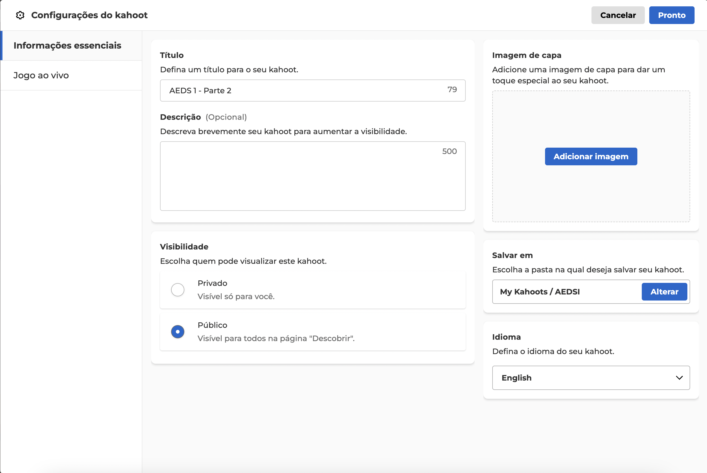

# Projeto KahootHack

## Descrição

O **Projeto KahootHack** tem como objetivo descobrir as respostas para qualquer Kahoot que tenha sido criado com visibilidade como "público". Ou seja, quizzes visíveis na página "Descobrir".

Por padrão, ao criar um Kahoot, a visibilidade é sempre definida como "público". Isso significa que, a menos que o criador configure o quiz como "privado", a URL da API retornará as respostas corretas para as perguntas do quiz. Prepare-se para a vitória!

### Exemplo de chamada para a API do Kahoot

```
https://play.kahoot.it/rest/kahoots/a5fba24d-e7e4-4cf2-8933-efc056232ba4
```

### Exemplo de resposta

```json
{
  "uuid": "a5fba24d-e7e4-4cf2-8933-efc056232ba4",
  "language": "English",
  "creator": "8d5d914e-acdc-4c84-b0f5-7b70ed60d3be",
  "creator_username": "joaopauloaramuni",
  "compatibilityLevel": 6,
  "creator_primary_usage": "teacher",
  "folderId": "cd58e2f6-3a0d-464c-98ac-64e995ca7970",
  "visibility": 1,
  "audience": "School",
  "title": "AEDS 1 - Parte 2",
  "description": "",
  "quizType": "quiz",
  "cover": "",
  "lobby_video": {
    "youtube": {
      "id": "",
      "startTime": 0,
      "endTime": 0,
      "service": "youtube",
      "fullUrl": ""
    }
  },
  "questions": [
    {
      "type": "quiz",
      "question": "\u003Cb\u003ENesse tipo de tradução de código, é gerado um arquivo de baixo nível:\u003C/b\u003E",
      "time": 20000,
      "points": true,
      "pointsMultiplier": 1,
      "choices": [
        {
          "answer": "Interpretação",
          "correct": false
        },
        {
          "answer": "Compilação híbrida",
          "correct": false
        },
        {
          "answer": "Compilação",
          "correct": true
        },
        {
          "answer": "Máquina virtual",
          "correct": false
        }
      ],
      "layout": "CLASSIC",
      "resources": "",
      "video": {
        "startTime": 0,
        "endTime": 0,
        "service": "youtube",
        "fullUrl": ""
      },
      "questionFormat": 0,
      "media": []
    },
```

### Exemplo de URL do jogo

```
https://play.kahoot.it/v2/lobby?quizId=a5fba24d-e7e4-4cf2-8933-efc056232ba4
```


### Exemplo de quizId:

```
a5fba24d-e7e4-4cf2-8933-efc056232ba4
```

O `quizId` é a única informação permanente referente ao quiz que você precisará antes do jogo começar para modificar na URL da API ou no próprio código Python. Com o `quizId` em mãos, basta responder às perguntas o mais rápido possível para vencer.

## Capturas de Tela

- **quizId**: Observe o quizId na url abaixo:

|         |
|:-------------------------------------------------------------:|
|                            Kahoot                             |

- **Visibilidade**: "Público" é a visibilidade padrão do Kahoot (para nossa sorte):

|  |
|:------------------------------------------------------------------:|
|                            Visibilidade                            |

## Instalação de Dependências

Este projeto utiliza a biblioteca `requests`.

```bash
pip install requests
```

### Ambiente Virtual

É recomendável usar um ambiente virtual para gerenciar as dependências. Siga os passos abaixo:

1. Crie um ambiente virtual:

    ```bash
    python3 -m venv .venv
    ```

2. Ative o ambiente virtual:
   - No macOS/Linux:

    ```bash
    source .venv/bin/activate
    ```

   - No Windows:

    ```bash
    .venv\Scripts\activate
    ```

3. Instale as dependências:

    ```bash
    pip install requests
    ```

## Código

```python
import requests
import re

# Função para remover tags HTML
def remove_html_tags(text):
    return re.sub(r'<.*?>', '', text)

# Função principal para processar o Kahoot
def process_kahoot(quiz_id):
    # Base da URL
    url_base = "https://play.kahoot.it/rest/kahoots"

    # Construção da URL completa
    url = f"{url_base}/{quiz_id}"

    # Fazendo a requisição
    response = requests.get(url)

    # Verificando se a requisição foi bem-sucedida
    if response.status_code == 200:
        data = response.json()  # Convertendo o JSON para um dicionário Python
        print("*" * 100)
        # Iterando pelas perguntas
        for index, question in enumerate(data.get("questions", []), start=1):
            # Removendo tags HTML da pergunta
            clean_question = remove_html_tags(question["question"])
            print(f"Pergunta {index}:")
            print(clean_question)  # Mostra a pergunta limpa

            # Exibindo as alternativas
            print("Alternativas:")
            for choice in question["choices"]:
                print(f"- {choice['answer']}")
            
            # Encontrando a resposta correta
            correct_answers = [choice["answer"] for choice in question["choices"] if choice["correct"]]
            print(f"Resposta correta: {', '.join(correct_answers)}")
            
            # Imprimindo 100 asteriscos entre as perguntas
            print("*" * 100)
    else:
        print(f"Erro na requisição: {response.status_code}")

# Função main
def main():
    # Variável para o quizId
    quiz_id = "a5fba24d-e7e4-4cf2-8933-efc056232ba4"
    process_kahoot(quiz_id)

# Executa o programa
if __name__ == "__main__":
    main()

```

### Explicação do código

#### remove_html_tags(text)
A função **remove_html_tags** é usada para limpar tags HTML presentes em um texto, tornando-o mais legível. Ela utiliza expressões regulares para identificar e remover qualquer conteúdo entre `<` e `>`. Isso é útil no contexto do Kahoot, onde perguntas podem conter formatações HTML desnecessárias.

##### Exemplo de Uso

```python
text = "<b>Essa é uma pergunta</b>"  
clean_text = remove_html_tags(text)  
# Resultado: "Essa é uma pergunta"
```

#### process_kahoot(quiz_id)
A função **process_kahoot** é responsável por interagir com a API do Kahoot usando o **quiz_id** para recuperar os dados do quiz. Ela constrói a URL da API, faz uma requisição GET, e processa as perguntas e respostas. Durante o processamento, as perguntas são limpas de HTML, as alternativas são listadas, e a resposta correta é identificada e exibida. Caso a requisição falhe, ela retorna um código de erro.

##### Fluxo da Função
1. Construção da URL: A URL é criada com base no **quiz_id**.
2. Requisição para a API: Realiza uma requisição HTTP GET para a API do Kahoot.
3. Processamento do JSON: Caso a requisição seja bem-sucedida, os dados do quiz são processados.
4. Exibição das Perguntas:
   - Remove as tags HTML das perguntas.
   - Lista as alternativas.
   - Exibe a(s) resposta(s) correta(s).

#### main()
A função **main** é o ponto de entrada do programa, onde o **quiz_id** é definido e passado para a função **process_kahoot**. Isso permite centralizar a execução do programa e garantir que o fluxo principal seja organizado. Ela é chamada dentro do bloco `if __name__ == "__main__"`, assegurando que o programa só execute diretamente e não ao ser importado como módulo.

### Exemplo de saída

```
*************************************************************************
Pergunta 1:
Nesse tipo de tradução de código, é gerado um arquivo de baixo nível:
Alternativas:
- Interpretação
- Compilação híbrida
- Compilação
- Máquina virtual
Resposta correta: Compilação
*************************************************************************
Pergunta 2:
São compiladores de Linguagem C, exceto:
Alternativas:
- GCC
- Clang
- MinGW
- GNU
Resposta correta: GNU
*************************************************************************
Pergunta 3:
A linguagem C é:
Alternativas:
- Fortemente tipada
- Fortemente e fracamente tipada
- Fracamente tipada
- Livre de tipos
Resposta correta: Fortemente tipada
*************************************************************************
```

## Documentação

Para mais informações sobre a API, visite a documentação oficial:

[Kahoot API Documentation](https://support.kahoot.com/hc/pt-br/articles/11735948502931-Guia-para-Kahoot-relat%C3%B3rios-API)

## Licença

Este projeto é de código aberto e está licenciado sob a MIT License. Sinta-se livre para usá-lo e modificá-lo conforme necessário.
