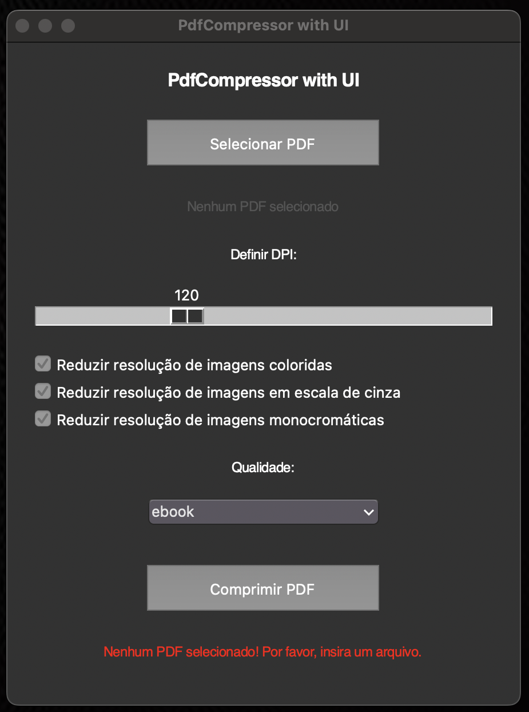
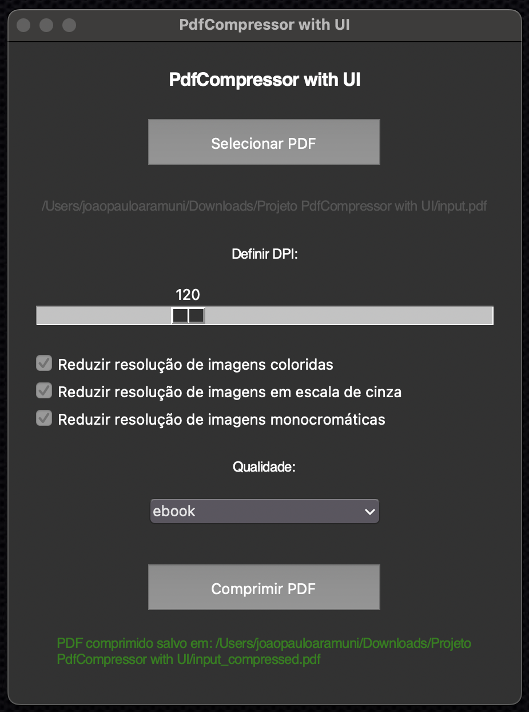

# Projeto PdfCompressor with UI

O **PdfCompressor** é um projeto para comprimir arquivos PDF utilizando a ferramenta **Ghostscript**. Agora, ele conta com uma interface gráfica (GUI) amigável, desenvolvida em Python com **Tkinter**, que facilita o uso e permite ajustar configurações diretamente em uma janela interativa. 

## Como funciona

A interface gráfica do PdfCompressor permite:
- **Selecionar arquivos PDF**: Com um botão dedicado para escolher o PDF desejado.
- **Definir DPI**: Um controle deslizante para ajustar a resolução das imagens dentro do PDF.
- **Configurar qualidade**: Escolha entre níveis predefinidos de qualidade (screen, ebook, printer, prepress).
- **Otimizar resolução de imagens**: Opções para reduzir a resolução de imagens coloridas, em escala de cinza e monocromáticas.
- **Feedback instantâneo**: Exibição de mensagens de sucesso ou erro diretamente na interface.

### Principais componentes da interface:

- **Botão "Selecionar PDF"**: Para carregar o arquivo PDF desejado.
- **Controle deslizante para DPI**: Ajusta a resolução das imagens entre 36 e 300 DPI.
- **Checkboxes para opções de imagem**: Permite escolher como lidar com imagens coloridas, em escala de cinza e monocromáticas.
- **Combobox de Qualidade**: Define o nível de qualidade do PDF comprimido.
- **Botão "Comprimir PDF"**: Inicia o processo de compressão.
- **Exibição de mensagens**: Mostra o caminho do arquivo selecionado, bem como o status do processo de compressão.

Com a GUI, o processo de compressão de PDFs ficou mais intuitivo, eliminando a necessidade de usar linhas de comando. Experimente e reduza o tamanho de seus PDFs com praticidade e eficiência!

---

## Capturas de Tela

|  |  |
|:-----------------------------------------------------------------:|:-------------------------------------------------------------------:|
|                                Home                               |                               Sucesso                               |

## Dependências

Para executar o projeto, é necessário instalar o **Ghostscript**. Siga as instruções abaixo para seu sistema operacional:

### Instalação do Ghostscript

#### **macOS (usando Homebrew):**
```bash
brew install ghostscript
```

#### **Linux (Debian/Ubuntu):**
```bash
sudo apt install ghostscript
```

#### **Windows:**
1. Baixe o instalador [aqui](https://ghostscript.com/).
2. Adicione o caminho do executável (`gswin64c.exe` ou `gswin32c.exe`) às variáveis de ambiente.

---

## O que é Ghostscript?

O **Ghostscript** é uma ferramenta de código aberto para manipulação de arquivos PDF e PostScript. Ele permite:
- Comprimir PDFs.
- Converter PDFs para outros formatos.
- Ajustar a resolução de imagens.
- Trabalhar com arquivos PostScript.

**Documentação oficial e links úteis:**
- [Página principal](https://www.ghostscript.com/)
- [Documentação oficial](https://www.ghostscript.com/documentation/index.html)
- [Ghostscript no ReadTheDocs](https://ghostscript.readthedocs.io/en/latest/)
- [Releases do Ghostscript](https://ghostscript.com/releases/gsdnld.html)

---

## Ambiente Virtual (venv)

### Passo 1: Criar e ativar o ambiente virtual

É recomendado criar um ambiente virtual para isolar as dependências do projeto. Para configurar o ambiente virtual:

1. **Criar o ambiente virtual**:
   ```bash
   python -m venv venv
   ```

2. **Ativar o ambiente virtual**:
   - No Windows:
     ```bash
     .venv\Scripts\activate
     ```
   - No macOS/Linux:
     ```bash
     source venv/bin/activate
     ```

### Passo 2: Executar o script

Após ativar o ambiente virtual, execute o script principal:
```bash
python main.py
```

## Versão do Python

Este projeto foi desenvolvido na versão **3.13.0** do Python.

---

## Exemplo de Saída

Ao executar o script, você pode esperar uma saída como esta:

```
2024-12-02 09:55:29.676 Python[92148:2422403] +[IMKClient subclass]: chose IMKClient_Modern
2024-12-02 09:55:29.677 Python[92148:2422403] +[IMKInputSession subclass]: chose IMKInputSession_Modern
GPL Ghostscript 10.04.0 (2024-09-18)
Copyright (C) 2024 Artifex Software, Inc.  All rights reserved.
This software is supplied under the GNU AGPLv3 and comes with NO WARRANTY:
see the file COPYING for details.
Processing pages 1 through 242.
Page 1
...
Page 242
Sucesso: PDF comprimido salvo em: /Users/joaopauloaramuni/Downloads/Projeto PdfCompressor with UI/input_compressed.pdf
```

No exemplo acima, o arquivo `input.pdf` com tamanho de 19,92 MB foi reduzido para 7,61 MB no arquivo comprimido `input_compressed.pdf`.

---

## Explicação do Código

### 1. **`input_pdf` e `output_pdf`**
- **`input_pdf`**: Especifica o caminho para o arquivo PDF original que será comprimido.
- **`output_pdf`**: Define o caminho e o nome do arquivo comprimido que será gerado pelo script.

### 2. **`quality`**
- Define o nível de compressão e qualidade para o arquivo PDF, utilizando os parâmetros predefinidos do Ghostscript:
  - **`screen`**: Compressão máxima com qualidade baixa. Ideal para leitura em tela, mas imagens podem perder nitidez significativa.
  - **`ebook`**: Boa compressão com qualidade moderada. Um equilíbrio ideal para leitura e compartilhamento.
  - **`printer`**: Qualidade alta com menor compressão. Adequado para impressão doméstica ou comercial.
  - **`prepress`**: Qualidade muito alta com mínima compressão. Recomendado para publicações profissionais e gráficas.

### 3. **`dpi`**
- Especifica a resolução máxima das imagens dentro do PDF:
  - **72 DPI**: Compressão agressiva. As imagens podem parecer pixeladas, mas o tamanho do arquivo será muito reduzido.
  - **100-150 DPI**: Oferece um bom equilíbrio entre qualidade e tamanho do arquivo. Adequado para leitura em tela e impressão básica.
  - **300 DPI**: Alta resolução, ideal para impressão de qualidade. Aumenta significativamente o tamanho do arquivo.

### 4. **Parâmetros de Ghostscript**
- **`-sDEVICE=pdfwrite`**: Especifica que o dispositivo de saída será um arquivo PDF.
- **`-dCompatibilityLevel=1.4`**: Define a compatibilidade do PDF gerado com a versão 1.4 do padrão PDF, garantindo maior compatibilidade com leitores antigos.
- **`-dPDFSETTINGS=/{quality}`**: Aplica o nível de compressão definido por `quality`.
- **`-dColorImageResolution={dpi}`**: Define a resolução máxima das imagens coloridas.
- **`-dGrayImageResolution={dpi}`**: Define a resolução máxima das imagens em escala de cinza.
- **`-dMonoImageResolution={dpi}`**: Define a resolução máxima das imagens monocromáticas.
- **`-dDownsampleColorImages=true`**: Ativa a redução de resolução (downsampling) para imagens coloridas.
- **`-dDownsampleGrayImages=true`**: Ativa a redução de resolução para imagens em escala de cinza.
- **`-dDownsampleMonoImages=true`**: Ativa a redução de resolução para imagens monocromáticas.
- **`-dColorImageDownsampleType=/Bicubic`**: Usa o método de amostragem bicúbica para imagens coloridas, garantindo boa qualidade visual ao reduzir a resolução.
- **`-dGrayImageDownsampleType=/Bicubic`**: Usa o método de amostragem bicúbica para imagens em escala de cinza.
- **`-dMonoImageDownsampleType=/Bicubic`**: Usa o método de amostragem bicúbica para imagens monocromáticas.
- **`-dNOPAUSE`**: Remove pausas interativas no processamento do Ghostscript.
- **`-dBATCH`**: Garante que o processo será executado como um único lote sem interação do usuário.
- **`-sOutputFile={output_pdf}`**: Especifica o caminho e o nome do arquivo PDF gerado.

Com essas configurações, o Ghostscript processa o PDF para reduzir o tamanho ajustando a resolução e recompactando os recursos internos, garantindo flexibilidade para diferentes necessidades de qualidade e tamanho. 

---

## Licença

Este projeto está licenciado sob a Licença MIT.
