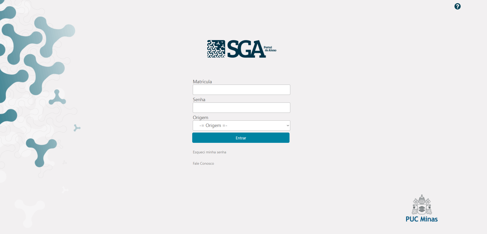

# Projeto SGA Spider

Este projeto está na sua versão inicial (v1) e realiza uma raspagem de dados para extrair as informações de faltas dos alunos de graduação da PUC Minas, diretamente da página do Sistema de Gestão Acadêmica [SGA](https://www.sistemas.pucminas.br/sgaaluno4/SilverStream/Pages/pgAln_LoginSSL.html).

## Captura de Tela

|  |
|:-------------------------------------------:|
|    **Sistema de Gestão Acadêmica (SGA)**    |

## Como Funcionará (v2 em construção)

Este projeto é uma aplicação Python que automatiza a consulta do número máximo de faltas possíveis e realiza o somatório das notas por disciplina para estudantes de graduação da PUC Minas. Ele utiliza web scraping para acessar o SGA e processar as informações de frequência e notas.

## Funcionalidades da versão 1

- **Login Automático**: Realiza login no portal do estudante da PUC Minas.
- **Extração de dados**:
  - Navega até a página de notas e frequência.
  - Extrai informações de faltas.
- **Exportação**:
  - Gera um arquivo `faltas.json` com informações de frequência.

## Funcionalidades da versão 2 (em construção)

- **Login Automático**: Realiza login no portal do estudante da PUC Minas.
- **Extração de Dados**:
  - Navega até a página de notas e frequência.
  - Extrai informações de disciplinas, faltas e notas.
- **Cálculo Automático**:
  - Soma as notas de cada disciplina, facilitando a visualização do desempenho total.
- **Exportação**:
  - Gera um arquivo `faltas.json` com informações de frequência e notas.

## Requisitos

- Python 3.8 ou superior
- Bibliotecas necessárias:
  - `requests`
  - `beautifulsoup4`
  
Você pode instalar as dependências com o comando:
```bash
pip install requests beautifulsoup4
```

## Como utilizar

### 1. Configuração Inicial

Substitua SUA MATRICULA e SUA SENHA na variável formdata com as credenciais do SGA.

### 2. Execução do código

Para executar o código e gerar a imagem a partir do texto especificado, basta utilizar o seguinte comando no terminal:

```bash
python3 sga_v1.py
```

Certifique-se de que você esteja no diretório onde o arquivo sga.py está localizado e que o ambiente virtual esteja ativado, caso você esteja usando um.

### 3. Saídas

O arquivo ```faltas.json``` será gerado na pasta do projeto contendo as informações das disciplinas.

## Ambiente Virtual

É recomendável usar um ambiente virtual para gerenciar suas dependências. Siga os passos abaixo para configurar um ambiente virtual:

1. Crie um ambiente virtual usando o seguinte comando:
    ```bash
    python3 -m venv .venv
    ```
2. Ative o ambiente virtual:
    - No macOS e Linux:
        ```bash
        source .venv/bin/activate
        ```
    - No Windows:
        ```bash
        .venv\Scripts\activate
        ```

## Documentação e links úteis

- [Requests - PyPI](https://pypi.org/project/requests/)
- [Beautiful Soup 4 - PyPI](https://pypi.org/project/beautifulsoup4/)
- [Documentação oficial do Beautiful Soup 4](https://beautiful-soup-4.readthedocs.io/en/latest/)

## Contribuição

Contribuições são bem-vindas! Sinta-se à vontade para abrir issues ou pull requests.

## Licença

Este projeto é distribuído sob a MIT License.
