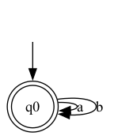
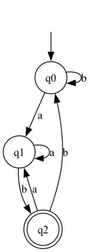
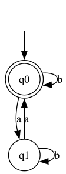
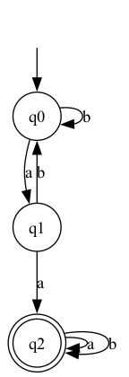
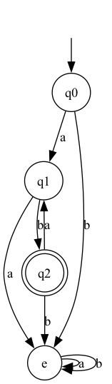

# Projeto Simulador de AFs

Este é um projeto para simular Autômatos Finitos (AFs) utilizando Python. Ele permite criar e visualizar diferentes linguagens reconhecidas por autômatos finitos, além de testar palavras para verificar se são aceitas ou rejeitadas.

## O que são Autômatos Finitos?

Autômatos Finitos são modelos computacionais usados para reconhecer linguagens formais. Eles consistem em:
- Um conjunto finito de estados.
- Um alfabeto de entrada.
- Transições que descrevem as mudanças entre os estados com base nos símbolos de entrada.
- Um estado inicial e um ou mais estados finais.

São amplamente utilizados em linguagens formais, compiladores, validação de expressões regulares e diversas outras áreas.

## Capturas de Tela

Os autômatos gerados são visualizados como grafos. Abaixo estão exemplos de visualizações dos autômatos implementados:

|  |  |  |  |  |
|:---------------------------------:|:---------------------------------:|:---------------------------------:|:---------------------------------:|:---------------------------------:|
| Linguagem que aceita apenas strings compostas pelos símbolos 'a' e 'b' | Linguagem que aceita apenas strings terminadas em 'ab' | Linguagem que aceita strings com um número par de 'a's | Linguagem que aceita strings contendo 'aa' como subcadeia | Linguagem que aceita apenas padrões 'ab' repetidos (com estado de erro) |

## Ambiente Virtual (venv)

É recomendado criar um ambiente virtual para isolar as dependências do projeto. Para configurar o ambiente virtual:

1. **Criar o ambiente virtual**:
   ```bash
   python -m venv venv
   ```

2. **Ativar o ambiente virtual**:
   - No Windows:
     ```bash
     .venv\Scripts\activate
     ```
   - No macOS/Linux:
     ```bash
     source venv/bin/activate
     ```

3. **Instalar as dependências**:
   ```bash
   pip install graphviz
   ```

## Sobre o Graphviz

O **Graphviz** é uma ferramenta poderosa para visualização de grafos. Neste projeto, ele é usado para desenhar os autômatos finitos. É necessário instalá-lo como um programa externo para permitir que os gráficos sejam renderizados.

### Instalação
1. No macOS/Linux:
   ```bash
   brew install graphviz
   ```
   **Por que instalar externamente?**
   O Graphviz utiliza ferramentas externas (como `dot`) para gerar gráficos. Essas ferramentas precisam estar disponíveis no sistema operacional para que a biblioteca Python funcione corretamente.

2. Instalar a biblioteca Python:
   ```bash
   pip install graphviz
   ```

## Estrutura do Projeto

### Arquivo: `main.py`
- **Função principal** do projeto. Apresenta um menu para escolher diferentes linguagens representadas por autômatos finitos.
- Permite o teste de palavras e a geração de gráficos para os autômatos.

### Arquivo: `linguagens.py`
- Define diferentes linguagens:
  - `linguagem_apenas_a_b`: Aceita strings com símbolos `a` e `b`.
  - `linguagem_terminadas_em_ab`: Aceita strings terminadas em `ab`.
  - `linguagem_par_de_as`: Aceita strings com número par de `a`s.
  - `linguagem_contem_aa`: Aceita strings que contenham a subcadeia `aa`.
  - `linguagem_somente_ab_repetido`: Aceita strings compostas por repetições do padrão `ab`.

### Arquivo: `automato.py`
- Implementa a classe `AutomatoFinito`, responsável por:
  - Criar e gerenciar estados.
  - Definir transições entre estados.
  - Simular a entrada de palavras e verificar se são aceitas.

### Arquivo: `visualizador.py`
- Contém a função `desenhar_automato`, que utiliza o Graphviz para desenhar gráficos representando os autômatos finitos.

### Arquivo: `estado.py`
- Define a classe `Estado`, que representa um estado individual de um autômato. Inclui:
  - Nome do estado.
  - Informação sobre ser ou não um estado final.
  - Transições para outros estados.

## Documentação e Links Úteis

- [Documentação do Graphviz](https://graphviz.org/documentation/)
- [Download do Graphviz](https://graphviz.org/download/)
- [Biblioteca Graphviz no PyPI](https://pypi.org/project/graphviz/)
- [Pygraphviz - Alternativa ao Graphviz](https://pygraphviz.github.io/documentation/stable/install.html)

## Licença

Este projeto está licenciado sob a Licença MIT.
