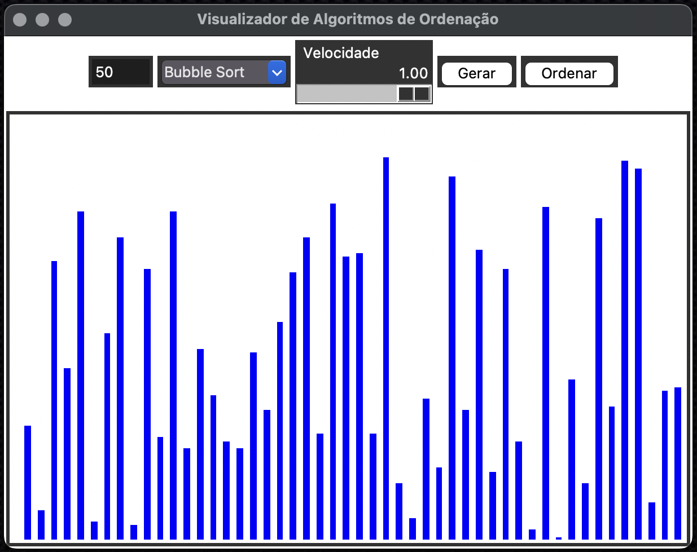
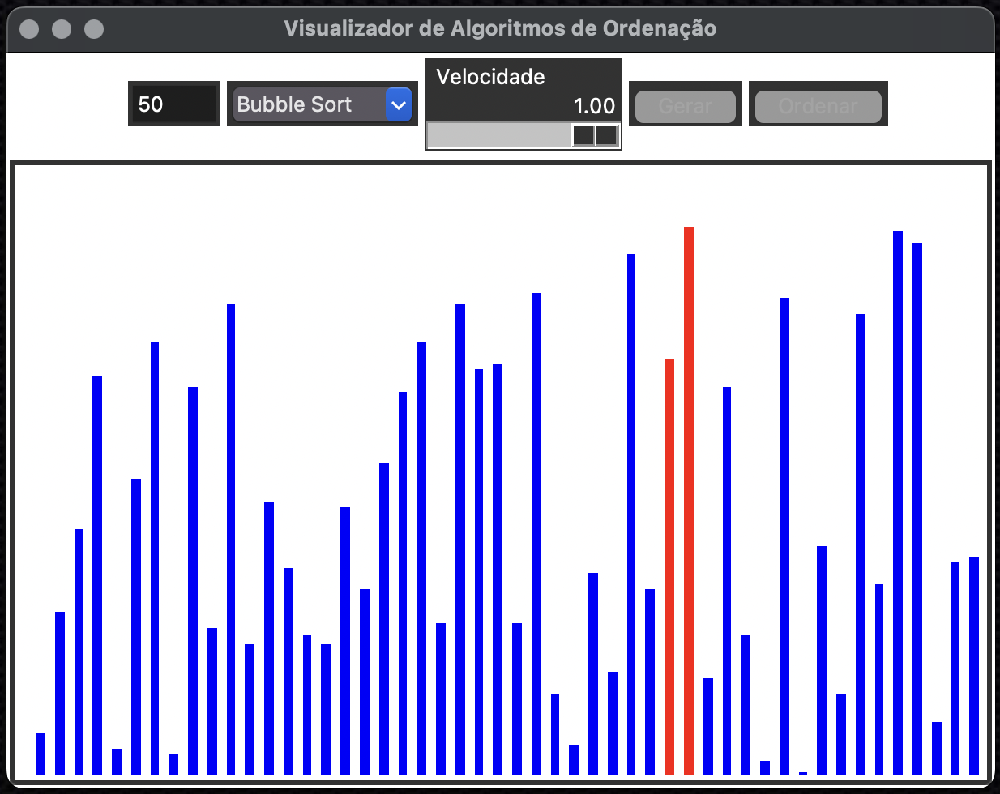
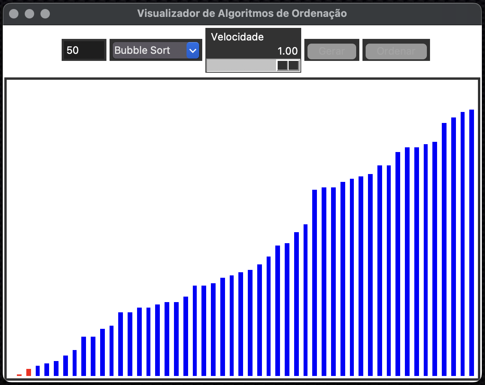
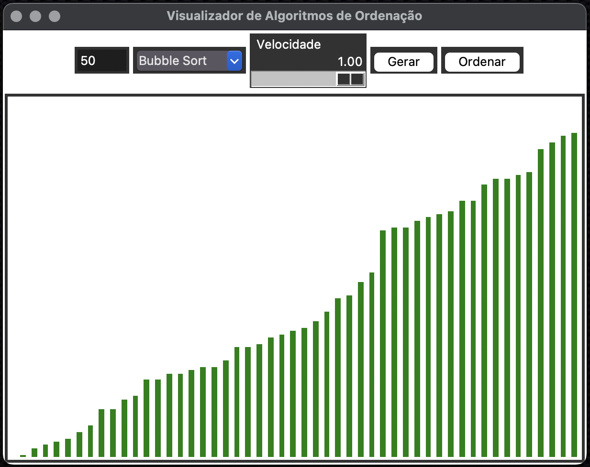

# Projeto Sort View

Visualizador de algoritmos de ordenação com interface gráfica usando Tkinter.  
Permite visualizar passo a passo os seguintes algoritmos:  
- Bubble Sort  
- Merge Sort  
- Quick Sort  
- Selection Sort

---

## 🎯 Funcionalidades

- Geração aleatória de listas com tamanho definido pelo usuário.
- Escolha entre diferentes algoritmos de ordenação.
- Controle de velocidade de visualização.
- Visualização com cores indicativas do estado de cada elemento.

---

## 📦 Dependências

```python
import tkinter as tk
from tkinter import ttk
import random
import time
import threading
```

---

## 🖼️ Capturas de tela

|  |  |
|:---------------------:|:-----------------:|
| Tela geração | Tela ordenação | 

|  |  |
|:---------------------:|:-----------------:|
| Tela ordenação | Tela ordenação | 

---

## ⚙️ Ambiente virtual

1. **Crie um ambiente virtual:**

   ```bash
   python -m venv .venv
   ```

2. **Ative o ambiente virtual:**

   - **Windows:**
     ```bash
     .venv\Scripts\activate
     ```

   - **Linux/MacOS:**
     ```bash
     source .venv/bin/activate
     ```

---

# Componentes Tkinter Utilizados

No projeto, diversos componentes do **Tkinter** foram usados para criar a interface gráfica e interagir com o usuário. Abaixo estão os principais componentes usados:

---

## 1. `tk.Tk()`
- Cria a janela principal da aplicação, também chamada de **root window**.
- Exemplo:
  ```python
  window = tk.Tk()
  ```

---

## 2. `tk.Frame`
- Um container para agrupar e organizar outros widgets. Ele ajuda na organização visual dos componentes na interface.
- Exemplo:
  ```python
  UI_frame = tk.Frame(window, width=900, height=200, bg="white")
  UI_frame.grid(row=0, column=0, sticky="w", padx=2, pady=2)
  ```

---

## 3. `tk.Label`
- Exibe texto na interface gráfica. No caso, é usado para exibir o texto "Tamanho:" ao lado do campo de entrada de dados.
- Exemplo:
  ```python
  tk.Label(UI_frame, text="Tamanho:", bg="white").grid(row=0, column=0, sticky=tk.W, padx=2, pady=2)
  ```

---

## 4. `tk.Entry`
- Um campo de entrada de texto, usado para capturar o tamanho da lista a ser ordenada.
- Exemplo:
  ```python
  size_entry = tk.Entry(UI_frame, width=5)
  size_entry.grid(row=0, column=1, padx=2, pady=2)
  size_entry.insert(0, "50")
  ```

---

## 5. `ttk.Combobox`
- Um menu suspenso que permite ao usuário escolher um algoritmo de ordenação.
- Exemplo:
  ```python
  algo_menu = ttk.Combobox(UI_frame, width=10, values=["Bubble Sort", "Merge Sort", "Quick Sort", "Selection Sort"], state="readonly")
  algo_menu.grid(row=0, column=2, padx=2, pady=2)
  algo_menu.current(0)
  ```

---

## 6. `tk.Scale`
- Um controle deslizante (slider) usado para ajustar a velocidade da animação durante a execução do algoritmo.
- Exemplo:
  ```python
  speed_scale = tk.Scale(UI_frame, from_=0.01, to=1.0, resolution=0.01, length=120,
                         digits=3, orient=tk.HORIZONTAL, label="Velocidade")
  speed_scale.grid(row=0, column=3, padx=2, pady=2)
  speed_scale.set(1.0)
  ```

---

## 7. `tk.Button`
- Um botão que executa uma ação quando pressionado. No caso, temos dois botões: um para gerar uma lista aleatória e outro para iniciar a ordenação.
- Exemplo para o botão de gerar:
  ```python
  generate_button = tk.Button(UI_frame, text="Gerar", command=generate, bg="lightgray")
  generate_button.grid(row=0, column=4, padx=2, pady=2)
  ```

---

## 8. `tk.Canvas`
- Um widget usado para desenhar gráficos e outras formas geométricas. Aqui, ele é usado para desenhar as barras que representam os elementos da lista.
- Exemplo:
  ```python
  canvas = tk.Canvas(window, width=600, height=380, bg="white")
  canvas.grid(row=1, column=0, sticky="w", padx=2, pady=2)
  ```

---

## 9. `window.mainloop()`
- Inicia o loop de eventos da interface gráfica, que mantém a aplicação em execução até que o usuário a feche.
- Exemplo:
  ```python
  window.mainloop()
  ```

---

Esses são os componentes principais do **Tkinter** utilizados no seu projeto. Eles foram combinados para criar uma interface interativa e dinâmica para a visualização dos algoritmos de ordenação.

## 📚 Documentação e Links úteis

- [Tkinter (Documentação Oficial)](https://docs.python.org/3/library/tkinter.html)

---

## 🧠 Autor

Desenvolvido como um projeto de visualização de algoritmos de ordenação com Python + Tkinter.

## Licença

Este projeto está licenciado sob a **Licença MIT**.
