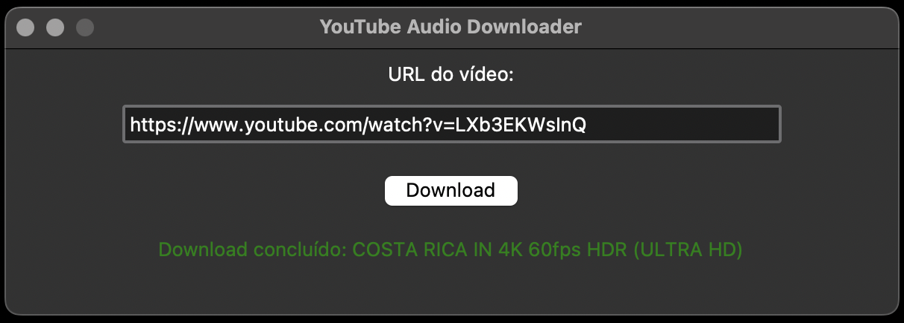
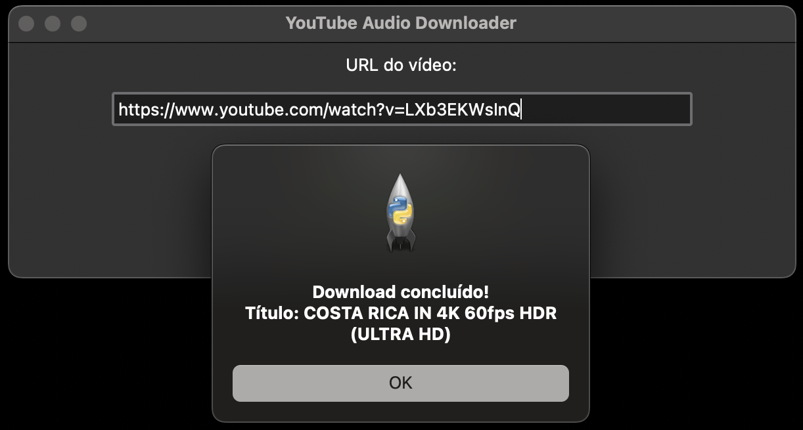

# YouTube Audio Downloader with UI

Este é um projeto para baixar o áudio de vídeos do YouTube utilizando a biblioteca `yt_dlp`, uma ferramenta poderosa que facilita o download de conteúdo na melhor qualidade disponível. O áudio é extraído, convertido para MP3 e salvo com o título original do vídeo.

## Interface Gráfica

Uma interface gráfica simples foi criada utilizando `tkinter` para facilitar a interação do usuário. A interface possui os seguintes elementos:

- Campo para entrada de URL.
- Botão de "Download" para iniciar o download.
- Mensagem de status para indicar o progresso ou erros.

## Capturas de Tela

|  |  |
|:----------------------------------------------------------:|:---------------------------------------------------------:|
|                          Home                              |                        Validação                         |
|     |   |
|                        Download                            |                         Download                          |

## Pré-requisitos

Certifique-se de ter o Python instalado (versão 3.6 ou superior é recomendada).

## Dependências

Este projeto requer a instalação das seguintes dependências:

**yt_dlp**: Para gerenciar o download de áudios.

```bash
pip install yt-dlp
```

O `yt_dlp` é uma ferramenta poderosa para baixar vídeos e áudios de várias plataformas, como YouTube, Vimeo, Twitch, entre outras. Ele é uma ramificação aprimorada do `youtube-dl`, com maior suporte e novas funcionalidades.

### Principais funcionalidades do `yt_dlp`:

- Download de alta qualidade: Escolha o melhor formato disponível para vídeo ou áudio.
- Suporte a várias plataformas: Compatível com centenas de sites de streaming e redes sociais.
- Filtragem de formatos: Permite selecionar apenas áudio, apenas vídeo ou combinações específicas.
- Customização: Oferece muitas opções de configuração para personalizar o download.
- Integração com FFmpeg: Realiza conversões e edições avançadas de áudio e vídeo.

### Exemplo de uso básico:

Baixando apenas o áudio de um vídeo:

    yt-dlp -x --audio-format mp3 https://www.youtube.com/watch?v=EXEMPLO

- `-x`: Extrai apenas o áudio.
- `--audio-format mp3`: Converte o áudio para o formato MP3.

Baixando o melhor formato de vídeo e áudio:

    yt-dlp -f best https://www.youtube.com/watch?v=EXEMPLO

- `-f best`: Seleciona o melhor formato disponível.

Para mais opções, consulte a documentação oficial: https://github.com/yt-dlp/yt-dlp.

---

**FFmpeg**: Necessário para realizar a conversão e manipulação de arquivos de áudio.

### Instalação do FFmpeg

- **macOS (usando Homebrew)**

  ```bash
  brew install ffmpeg
  ```

- **Ubuntu/Debian (Linux)**

  ```bash
  sudo apt update
  sudo apt install ffmpeg
  ```

- **Windows**

  Para Windows, o processo é um pouco diferente:

  1. Acesse o [site oficial do FFmpeg](https://ffmpeg.org/download.html) e baixe a versão mais recente para Windows.
  2. Extraia o arquivo baixado em uma pasta de fácil acesso.
  3. Adicione o caminho da pasta `bin` (onde está o executável `ffmpeg.exe`) à variável de ambiente **PATH**:
     - Abra o menu Iniciar e procure por **Variáveis de Ambiente**.
     - Edite a variável **Path** e adicione o caminho completo até a pasta `bin` do `ffmpeg`.
  5. Verifique a instalação no terminal (Prompt de Comando ou PowerShell) com:

     ```bash
     ffmpeg -version
     ```

O FFmpeg é uma ferramenta robusta para processar arquivos de multimídia. Ele é amplamente utilizado para converter, editar, e manipular vídeos e áudios em diversos formatos.

### Principais funcionalidades do `FFmpeg`:

- Conversão de formatos: Transforme arquivos para praticamente qualquer formato de áudio e vídeo.
- Edição de arquivos: Corte, junte, ou aplique filtros em arquivos multimídia.
- Extração de áudio: Extraia áudio de vídeos ou remova faixas específicas.
- Configuração de qualidade: Permite ajustar taxas de bits, resolução e outros parâmetros.

### Exemplo de uso básico:

Converter um arquivo para MP3:

  ```bash
  ffmpeg -i input.mp4 -q:a 0 output.mp3
  ```

- `-i input.mp4`: Especifica o arquivo de entrada.
- `-q:a 0`: Define a qualidade do áudio (0 é a melhor qualidade).
- `output.mp3`: Especifica o nome do arquivo de saída.

Cortar um trecho de um vídeo (exemplo dos primeiros 30 segundos):

  ```bash
  ffmpeg -i input.mp4 -ss 00:00:00 -t 00:00:30 -c copy output.mp4
  ```

- `-ss 00:00:00`: Define o ponto inicial (neste caso, o início do vídeo).
- `-t 00:00:30`: Define a duração do clipe.
- `-c copy`: Copia os fluxos sem reprocessamento.

Para mais detalhes, visite o site oficial do FFmpeg: https://ffmpeg.org.

---

**tkinter**: Usado para criar a interface gráfica com o usuário.

### Instalação no Linux/Ubuntu

O Tkinter geralmente já vem instalado em distribuições Linux, mas, caso necessário, você pode instalar com:

```bash
sudo apt-get install python3-tk
```

### Instalação no Windows

No Windows, o Tkinter já é incluído na instalação padrão do Python. Certifique-se de que o Python está corretamente instalado.

### Recursos Essenciais para Tkinter

Esta lista contém referências abrangentes para aprender, explorar e dominar o uso do **Tkinter**, uma biblioteca do Python para desenvolvimento de interfaces gráficas (GUIs).

#### **1. Documentação Oficial do Tkinter (Python)**
A documentação oficial do Python cobre todos os aspectos básicos e avançados do `tkinter`, com detalhes sobre widgets, métodos e exemplos práticos.

##### **Características**:
- Informações detalhadas sobre todos os widgets disponíveis.
- Explicações sobre eventos, layouts e estilos.
- Suporte a idiomas locais.

**Link**: [Documentação Oficial - Tkinter (Python)](https://docs.python.org/pt-br/3/library/tkinter.html)

---

#### **2. TkDocs: Um Guia Moderno para Tkinter**
O TkDocs é uma referência moderna para desenvolver GUIs com `tkinter`. O site fornece tutoriais, guias e práticas recomendadas.

##### **Características**:
- Abordagem prática e moderna para desenvolvimento com Tkinter.
- Exemplos e projetos aplicados.
- Tutoriais para iniciantes e desenvolvedores avançados.

**Link**: [TkDocs](https://tkdocs.com/)

---

#### **3. Documentação do Tk (Tcl)**
A documentação oficial do Tk fornece uma descrição técnica detalhada dos comandos do backend usado pelo `tkinter`. Este recurso é mais útil para desenvolvedores avançados que desejam entender as bases do Tkinter.

##### **Características**:
- Guia técnico de comandos e opções do Tk.
- Referência completa de configurações e customizações.
- Insights avançados para manipulação direta do Tk.

**Link**: [Documentação Oficial do Tk](https://tcl.tk/man/tcl8.6/TkCmd/contents.htm)

---

#### **4. Cursos e Recursos Adicionais**
Além das documentações oficiais, existem recursos adicionais que ajudam a aprofundar conhecimentos em `tkinter`:

##### **Python Tkinter Tutorial (GeeksforGeeks)**
- Uma introdução prática ao `tkinter`, com exemplos básicos e avançados.
- **Link**: [GeeksforGeeks - Python Tkinter Tutorial](https://www.geeksforgeeks.org/python-tkinter-tutorial/)

##### **Tutorial Tkinter (Real Python)**
- Um guia interativo com exemplos práticos para construção de GUIs.
- **Link**: [Real Python - Tkinter Tutorial](https://realpython.com/python-gui-tkinter/)

---

#### **5. Comunidade e Suporte**
- **Stack Overflow**: Para dúvidas específicas e resolução de problemas em Tkinter.  
  [Visitar Stack Overflow](https://stackoverflow.com/questions/tagged/tkinter)

- **Reddit - r/learnpython**: Uma comunidade ativa para iniciantes e desenvolvedores avançados em Python.  
  [Visitar Reddit r/learnpython](https://www.reddit.com/r/learnpython/)

---

## Configurações de qualidade do áudio

A qualidade do áudio é configurada utilizando o parâmetro `-q:a` (ou `-aq`). Para o codec MP3, os valores variam de **0** (melhor qualidade) a **9** (qualidade mais baixa). Esse parâmetro utiliza o **VBR (Variable Bit Rate)**.

### O que é VBR?

**VBR (Variable Bit Rate)** é uma técnica de codificação que ajusta dinamicamente a taxa de bits do áudio dependendo da complexidade da faixa sonora. Em trechos simples (como silêncio ou tons constantes), utiliza menos bits; em trechos mais complexos (como vocais ou instrumentos variados), utiliza mais bits.

Isso resulta em:
- Melhor qualidade geral em relação ao tamanho do arquivo.
- Arquivos menores do que os gerados com **CBR (Constant Bit Rate)**, que mantém uma taxa fixa.

### Relação entre qualidade e taxa de bits aproximada:


| Valor (`q`) | Taxa de Bits Aproximada (kbps) | Qualidade       |
|-------------|--------------------------------|-----------------|
| **0**       | 240-320                        | Excelente       |
| **2**       | 170-210                        | Boa (padrão)    |
| **4**       | 140-180                        | Média           |
| **6**       | 100-130                        | Baixa           |
| **9**       | ~65                            | Muito baixa     |

### Exemplo de uso com FFmpeg

Abaixo estão exemplos para definir a qualidade usando o `-q:a` no FFmpeg:

Configurar a melhor qualidade (q: 0):

  ```bash
  ffmpeg -i input.mp4 -q:a 0 output.mp3
  ```

Definir qualidade média (q: 4):

  ```bash
  ffmpeg -i input.mp4 -q:a 4 output.mp3
  ```

Gerar um arquivo com qualidade baixa (q: 9):

  ```bash
  ffmpeg -i input.mp4 -q:a 9 output.mp3
  ```

## Uso

1. Clone este repositório ou copie o código para um arquivo `.py`.
2. Execute o script e cole a URL do vídeo no campo texto indicado. 
3. Em seguida, clique no botão `Download` para baixar o áudio do vídeo.

## Código

Abaixo está o código principal do projeto:

```python
from yt_dlp import YoutubeDL

# URL do vídeo
url = 'https://www.youtube.com/watch?v=LXb3EKWsInQ'

# Configurações de download
ydl_opts = {
    "format": "bestaudio/best",  # Escolhe o melhor áudio disponível
    "outtmpl": "audios/%(title)s.%(ext)s",  # Salva o áudio com o título original
    "postprocessors": [{  
        "key": "FFmpegExtractAudio",
        "preferredcodec": "mp3",  # Converte para MP3
    }],
    "postprocessor_args": [
        "-q:a", "0"  # Preserva a qualidade original ao máximo
    ],
    "prefer_ffmpeg": True,  # Garante que o FFmpeg será usado
}

with YoutubeDL(ydl_opts) as ydl:
    info = ydl.extract_info(url, download=True)  # Baixa somente o áudio
    print("Título do áudio:", info.get('title'))
    print("Download concluído!")
```

## Ambiente virtual

É recomendável usar um ambiente virtual para gerenciar as dependências. Siga os passos abaixo:

1. Crie um ambiente virtual:

    ```bash
    python3 -m venv .venv
    ```

2. Ative o ambiente virtual:
   - No macOS/Linux:

    ```bash
    source .venv/bin/activate
    ```

   - No Windows:

    ```bash
    .venv\Scripts\activate
    ```

3. Instale as dependências:

    ```bash
    pip install yt-dlp
    ```

## Documentação e Links Úteis

- [Repositório oficial do yt-dlp](https://github.com/yt-dlp/yt-dlp)
- [Pacote yt-dlp no PyPI](https://pypi.org/project/yt-dlp/)
- [Repositório oficial do FFmpeg](https://github.com/FFmpeg/FFmpeg)
- [Página inicial do FFmpeg](https://ffmpeg.org/ffmpeg.html)
- [Documentação completa do FFmpeg](https://ffmpeg.org/documentation.html)
- [Página de download do FFmpeg](https://ffmpeg.org/download.html)
- [Documentação Oficial - Tkinter (Python)](https://docs.python.org/pt-br/3/library/tkinter.html)
- [Tk Commands](https://tcl.tk/man/tcl8.6/TkCmd/contents.htm)
- [TkDocs](https://tkdocs.com/)

## Licença

Este projeto é de código aberto e está licenciado sob a MIT License. Sinta-se livre para usá-lo e modificá-lo conforme necessário.
