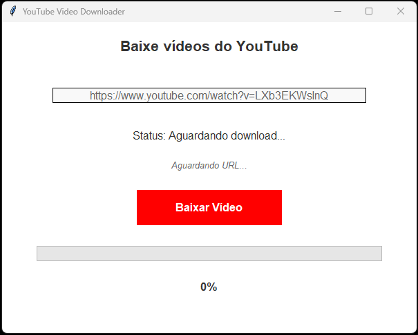
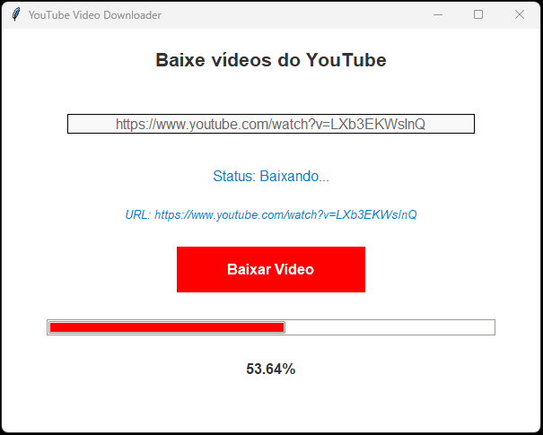

# YouTube Video Downloader with UI

Este é um projeto aprimorado para baixar vídeos do YouTube, agora com uma interface gráfica intuitiva, que permite aos usuários colar o link do vídeo e gerenciar o download facilmente. O projeto utiliza a biblioteca yt_dlp para gerenciar os downloads na melhor qualidade disponível.

## Interface Gráfica

A interface gráfica permite que o usuário insira o link do vídeo, visualize e inicie o download com um clique. Para usar, basta iniciar o programa e colar o link do YouTube no campo designado.

### Capturas de Tela

- **Tela Inicial**: Campo para inserir o link do vídeo e botão de download.
- **Tela de Progresso**: Exibe o progresso do download.

|  |  |
|:-----------------------------:|:-----------------------------------:|
|          Tela Inicial         |        Tela de Progresso           |

## Pré-requisitos

Certifique-se de ter o Python instalado (versão 3.6 ou superior é recomendada).

## Dependências

Este projeto requer a instalação das seguintes dependências:

**yt_dlp**: Para gerenciar o download de vídeos.

### youtube-dl

[youtube-dl GitHub Repository](https://github.com/ytdl-org/youtube-dl)

**Descrição**: youtube-dl é uma ferramenta de linha de comando que permite baixar vídeos de YouTube e muitos outros sites de vídeo. É altamente configurável e suporta uma ampla variedade de formatos e opções de download.

**Principais recursos**:
- Suporte para download de vídeos de diversos sites.
- Opções para selecionar formato e qualidade dos vídeos.
- Integração com scripts e automações.

Este projeto requer a instalação da biblioteca `yt_dlp`. Siga as instruções abaixo para instalá-la:

```bash
pip3 install yt-dlp
```

**FFmpeg**: Necessário para combinar áudio e vídeo em alta qualidade. Siga as instruções de instalação para seu sistema operacional abaixo.

### FFmpeg

**Descrição**: O `ffmpeg` é uma ferramenta essencial para manipulação de arquivos de áudio e vídeo e é necessário para que o `yt_dlp` consiga baixar vídeos em alta qualidade (como 720p e 1080p) do YouTube e de outras plataformas. Ele permite que o `yt_dlp` combine vídeo e áudio em um único arquivo, especialmente quando esses são disponibilizados separadamente em resoluções maiores.

Por que o `ffmpeg` é necessário para `yt_dlp`?

Para vídeos em alta resolução, o YouTube geralmente armazena o vídeo e o áudio em arquivos separados (isso é chamado de *DASH format*). O `ffmpeg` permite que o `yt_dlp` combine esses arquivos em um único arquivo completo com áudio e vídeo sincronizados e em alta qualidade.

**Instalação do FFmpeg**

- macOS (usando Homebrew)

  Se você usa macOS e já tem o Homebrew instalado, basta rodar o seguinte comando no terminal:

  ```bash
  brew install ffmpeg
  ```

  Após a instalação, confirme que o `ffmpeg` foi instalado corretamente com o comando:

  ```bash
  ffmpeg -version
  ```

- Ubuntu/Debian (Linux)

  No Ubuntu ou em outras distribuições baseadas no Debian, você pode instalar o `ffmpeg` com o seguinte comando:

  ```bash
  sudo apt update
  sudo apt install ffmpeg
  ```

  Assim como no macOS, verifique a instalação rodando:

  ```bash
  ffmpeg -version
  ```

- Windows

  Para Windows, o processo é um pouco diferente:

  1. Acesse o [site oficial do FFmpeg](https://ffmpeg.org/download.html) e baixe a versão mais recente para Windows.
  2. Extraia o arquivo baixado em uma pasta de fácil acesso.
  3. Adicione o caminho da pasta `bin` (onde está o executável `ffmpeg.exe`) à variável de ambiente **PATH**:
     - Abra o menu Iniciar e procure por **Variáveis de Ambiente**.
     - Edite a variável **Path** e adicione o caminho completo até a pasta `bin` do `ffmpeg`.
  5. Verifique a instalação no terminal (Prompt de Comando ou PowerShell) com:

     ```bash
     ffmpeg -version
     ```

Após a instalação, o `yt_dlp` deverá conseguir usar o `ffmpeg` automaticamente para combinar vídeo e áudio e gerar arquivos de alta qualidade.


**tkinter**: Usado para criar a interface gráfica com o usuário.

### Instalação no Linux/Ubuntu

O Tkinter geralmente já vem instalado em distribuições Linux, mas, caso necessário, você pode instalar com:

```bash
sudo apt-get install python3-tk
```

### Instalação no Windows

No Windows, o Tkinter já é incluído na instalação padrão do Python. Certifique-se de que o Python está corretamente instalado.

### Recursos Essenciais para Tkinter

Esta lista contém referências abrangentes para aprender, explorar e dominar o uso do **Tkinter**, uma biblioteca do Python para desenvolvimento de interfaces gráficas (GUIs).

#### **1. Documentação Oficial do Tkinter (Python)**
A documentação oficial do Python cobre todos os aspectos básicos e avançados do `tkinter`, com detalhes sobre widgets, métodos e exemplos práticos.

##### **Características**:
- Informações detalhadas sobre todos os widgets disponíveis.
- Explicações sobre eventos, layouts e estilos.
- Suporte a idiomas locais.

**Link**: [Documentação Oficial - Tkinter (Python)](https://docs.python.org/pt-br/3/library/tkinter.html)

---

#### **2. TkDocs: Um Guia Moderno para Tkinter**
O TkDocs é uma referência moderna para desenvolver GUIs com `tkinter`. O site fornece tutoriais, guias e práticas recomendadas.

##### **Características**:
- Abordagem prática e moderna para desenvolvimento com Tkinter.
- Exemplos e projetos aplicados.
- Tutoriais para iniciantes e desenvolvedores avançados.

**Link**: [TkDocs](https://tkdocs.com/)

---

#### **3. Documentação do Tk (Tcl)**
A documentação oficial do Tk fornece uma descrição técnica detalhada dos comandos do backend usado pelo `tkinter`. Este recurso é mais útil para desenvolvedores avançados que desejam entender as bases do Tkinter.

##### **Características**:
- Guia técnico de comandos e opções do Tk.
- Referência completa de configurações e customizações.
- Insights avançados para manipulação direta do Tk.

**Link**: [Documentação Oficial do Tk](https://tcl.tk/man/tcl8.6/TkCmd/contents.htm)

---

#### **4. Cursos e Recursos Adicionais**
Além das documentações oficiais, existem recursos adicionais que ajudam a aprofundar conhecimentos em `tkinter`:

##### **Python Tkinter Tutorial (GeeksforGeeks)**
- Uma introdução prática ao `tkinter`, com exemplos básicos e avançados.
- **Link**: [GeeksforGeeks - Python Tkinter Tutorial](https://www.geeksforgeeks.org/python-tkinter-tutorial/)

##### **Tutorial Tkinter (Real Python)**
- Um guia interativo com exemplos práticos para construção de GUIs.
- **Link**: [Real Python - Tkinter Tutorial](https://realpython.com/python-gui-tkinter/)

---

#### **5. Comunidade e Suporte**
- **Stack Overflow**: Para dúvidas específicas e resolução de problemas em Tkinter.  
  [Visitar Stack Overflow](https://stackoverflow.com/questions/tagged/tkinter)

- **Reddit - r/learnpython**: Uma comunidade ativa para iniciantes e desenvolvedores avançados em Python.  
  [Visitar Reddit r/learnpython](https://www.reddit.com/r/learnpython/)

---

## Uso

1. Clone este repositório ou copie o código para um arquivo `.py`.
2. Execute o script.

O script está configurado para baixar o vídeo na URL especificada e salvá-lo no diretório videos na raiz do projeto.

## Código

Abaixo está o código principal do projeto:

```python
def download_video():
    url = url_entry.get()
    if not url:
        messagebox.showwarning("Aviso", "Por favor, insira uma URL.")
        return

    # Muda o texto do botão e desabilita enquanto baixa
    download_button.config(text="Baixando...", state=tk.DISABLED)
    status_label.config(text="Baixando...")

    threading.Thread(target=run_downloader, args=(url,)).start()


def run_downloader(url):
    ydl_opts = {
        "format": "bestvideo[height<=1080]+bestaudio/best",  # Prioriza 1080p, caindo para a melhor disponível
        "outtmpl": "videos/%(title)s.%(ext)s",  # Salva o vídeo com o título original
        "merge_output_format": "mp4",  # Garante que o vídeo e áudio estejam em MP4
    }

    try:
        with YoutubeDL(ydl_opts) as ydl:
            info = ydl.extract_info(url, download=True)
            window.after(100, lambda: update_progress(100, "100%"))
            messagebox.showinfo(
                "Sucesso", f"Download concluído!\nTítulo: {info.get('title')}"
            )
    except Exception as ex:
        window.after(
            100,
            lambda ex=ex: messagebox.showerror(
                "Erro", f"Ocorreu um erro ao baixar o vídeo: {ex}"
            ),
        )
    finally:
        # Reinicia o botão e o rótulo de status após completar o download
        window.after(100, reset_ui)
```


# Configurações de download

A configuração `ydl_opts` é um dicionário que define como o `yt_dlp` deve baixar o vídeo. Veja cada opção:

- **'format': 'bestvideo[height<=1080]+bestaudio/best'**: Esta opção define o formato do vídeo a ser baixado. A configuração prioriza o download da melhor qualidade de vídeo que não exceda 1080p, combinando isso com a melhor qualidade de áudio disponível. Se não houver um vídeo disponível na qualidade especificada, o `yt_dlp` tentará baixar o melhor vídeo disponível.

- **'outtmpl': '%(title)s.%(ext)s'**: Esta opção define o template de saída para os arquivos baixados. O vídeo será salvo com o título original do vídeo do YouTube, seguido da extensão apropriada (como .mp4).

- **'merge_output_format': 'mp4'**: Esta opção garante que, ao combinar o áudio e o vídeo, o formato final do arquivo será MP4. Isso é especialmente útil quando os arquivos de áudio e vídeo são baixados separadamente e precisam ser mesclados em um único arquivo.

Essas configurações ajudam a garantir que o vídeo seja baixado na melhor qualidade possível, enquanto mantém a compatibilidade com a maioria dos dispositivos e reprodutores de mídia, usando o formato MP4.

## Executando o Código

Para rodar o código, basta executar o seguinte comando no terminal:

```bash
python3 app.py
# ou
python3 interface.py
```

O vídeo será baixado com o título original do YouTube e salvo na pasta videos.

## Ambiente virtual

É recomendável usar um ambiente virtual para gerenciar suas dependências. Siga os passos abaixo para configurar um ambiente virtual:

1. Crie um ambiente virtual usando o seguinte comando:

    ```bash
    python3 -m venv .venv
    ```

2. Ative o ambiente virtual:
   - No macOS e Linux:

    ```bash
    source .venv/bin/activate
    ```
   - No Windows:

    ```bash
    .venv\Scripts\activate
    ```

Após ativar o ambiente virtual, você pode instalar a dependência do yt-dlp conforme mencionado anteriormente.

## Como Gerar o Executável

Para gerar o executável, siga os passos abaixo:

1. Certifique-se de ter o `PyInstaller` instalado. Caso não tenha, instale com o comando:
   ```bash
   pip3 install pyinstaller
   ```

2. Navegue até o diretório onde o código-fonte está salvo e execute o seguinte comando:
   ```bash
   # Com caminho relativo
   pyinstaller --onefile --windowed --icon=icon.ico app.py

    # Com caminho absoluto
   pyinstaller --clean --onefile --windowed --icon="C:\prj\icon.ico" "C:\prj\app.py"
   ```

   - `--onefile`: Cria um único arquivo executável.
   - `--windowed`: Oculta o terminal ao abrir a interface gráfica.
   - `--icon=icon.ico`: Define o ícone do executável como `icon.ico`.

3. O executável gerado estará na pasta `dist/`.

## Como Usar

1. Abra o arquivo executável (`compressor.exe`).
2. Na interface, clique em "Selecionar Imagem" para escolher uma imagem do seu computador.
3. Use o controle deslizante para ajustar a qualidade da compressão (quanto menor o valor, maior a compressão).
4. Clique em "Comprimir Imagem" para salvar a imagem comprimida.

## Observação

Para baixar vídeos de URLs diferentes, altere o valor da variável `url` no código. 

## Documentação e Links Úteis

- [Repositório oficial do yt-dlp](https://github.com/yt-dlp/yt-dlp)
- [Pacote yt-dlp no PyPI](https://pypi.org/project/yt-dlp/)
- [Repositório oficial do FFmpeg](https://github.com/FFmpeg/FFmpeg)
- [Página inicial do FFmpeg](https://ffmpeg.org/ffmpeg.html)
- [Documentação completa do FFmpeg](https://ffmpeg.org/documentation.html)
- [Página de download do FFmpeg](https://ffmpeg.org/download.html)
- [Documentação Oficial - Tkinter (Python)](https://docs.python.org/pt-br/3/library/tkinter.html)
- [Tk Commands](https://tcl.tk/man/tcl8.6/TkCmd/contents.htm)
- [TkDocs](https://tkdocs.com/)

## Licença

Este projeto é de código aberto e está licenciado sob a MIT License. Sinta-se livre para usá-lo e modificá-lo conforme necessário.
